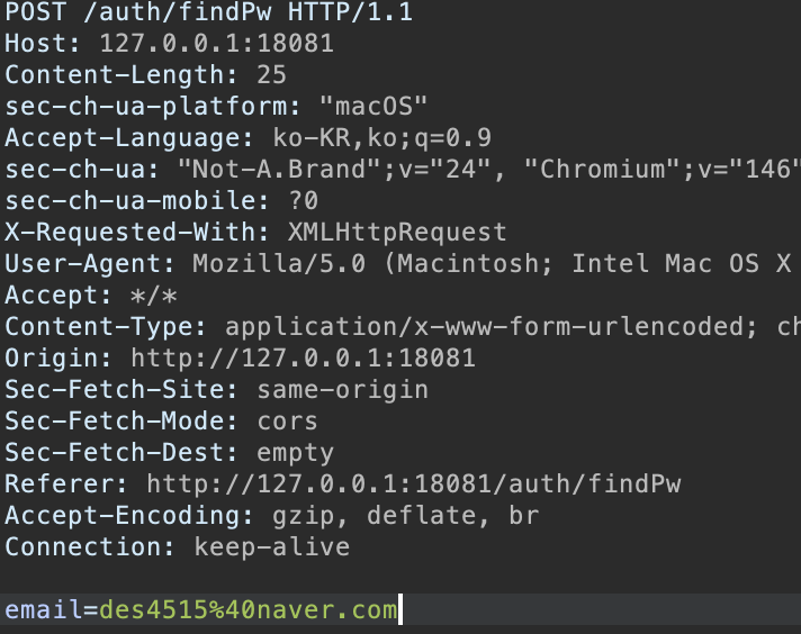
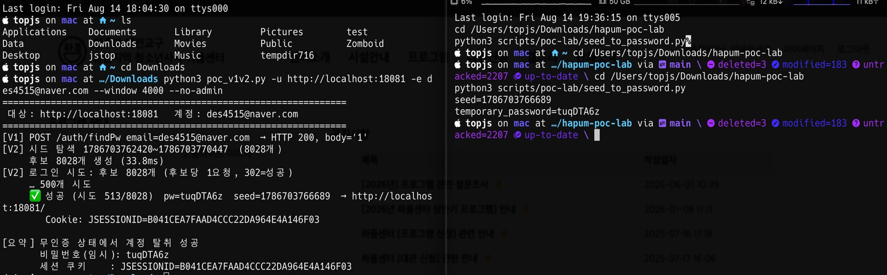

# ASC 프로젝트 최종 기술 보고서 — 하품 홈페이지 웹 서비스 보안 취약점 분석

- **참여 인원:** (팀장) 20245035_강준수, (팀원) 20245039_김레빈, 20251790_김준수, 20252751_김홍균
- **프로젝트 구분:** 심화 프로젝트

---

## 1. 개요 및 목적

### 배경

웹 애플리케이션의 보안 취약점은 단순한 입력값 검증 실패뿐 아니라 인증 상태, 객체 소유권, 세션 관리, 서버·클라이언트 간 Trust Boundary, 비즈니스 로직이 결합되는 과정에서 발생한다.

특히 정상적인 UI 흐름에서는 문제가 드러나지 않더라도 HTTP 요청의 사용자 식별자, 객체 ID, 인증 상태값, 가격·정원·승인 상태와 같은 정책값을 직접 변조하면 서버가 의도하지 않은 동작을 수행할 수 있다. 따라서 실제 웹 서비스의 보안성을 평가하기 위해서는 정형화된 Payload 적용뿐 아니라 **어떤 값을 누가 결정하는지, 서버가 어느 시점에서 신뢰를 부여하는지, 최종 데이터 변경 조건에 권한 검증이 포함되어 있는지**를 함께 분석해야 한다.

본 프로젝트에서는 실제 운영 중인 하품(Hapum) 웹 서비스를 대상으로 공개 공격 표면을 식별한 뒤, 제공받은 Spring Boot 애플리케이션 소스코드와 DB 구조를 바탕으로 화이트박스 분석을 수행하였다. 데이터 삭제, 계정 상태 변경, 인증 우회처럼 실제 영향이 발생할 수 있는 검증은 운영 환경이 아닌 별도의 로컬 재현 환경에서 수행하였다.

### 목표

본 프로젝트의 목표는 다음과 같다.

1. 하품 웹 서비스의 Attack Surface 식별
2. 인증·인가·세션·CSRF·XSS·파일 처리·비즈니스 로직 분석
3. Controller → Service → Mapper까지 추적하여 취약점 Root Cause 규명
4. 통제된 로컬 환경에서 주요 취약 동작 재현
5. HTTP, Session, DB State를 기준으로 실제 영향 검증
6. 주요 취약점 수정 및 동일 공격 조건의 재검증
7. 보안 수정 이후 Regression Verification 수행

전체 분석 흐름은 다음과 같다.

```text
Attack Surface Identification
        ↓
Vulnerability Hypothesis
        ↓
White-box Analysis
        ↓
Controlled Reproduction
        ↓
Impact Verification
        ↓
Root Cause Analysis
        ↓
Remediation
        ↓
Regression Verification
```

---

## 2. 기술적 상세 분석

### 환경 구성

| 구분 | 구성 |
|---|---|
| Backend | Spring Boot |
| Template Engine | Thymeleaf |
| Database | MySQL |
| State / Cache | Redis |
| Reverse Proxy | Nginx |
| Authentication | Session-based Authentication |
| ORM / DB Access | MyBatis Mapper |
| Rich Text Editor | Summernote |

초기에는 공개 HTTP 요청·응답을 통해 Endpoint, 세션 Cookie, CORS, Error Response, 공개 HTML/JavaScript, Security Header 등을 확인하였다. 이후 소스코드를 확보한 뒤 Controller, Service, Mapper, SecurityConfig, Template, File Handling Logic을 추적하여 서버의 Trust Boundary와 Authorization Enforcement Point를 분석하였다.

동적 검증은 Docker 기반 MySQL·Redis와 로컬 Spring Boot 애플리케이션으로 구성한 격리 환경에서 수행하였다.

### 핵심 Finding 요약

| 분류 | 주요 Finding | 주요 영향 |
|---|---|---|
| Broken Access Control | 회원 탈퇴 IDOR | 타 사용자 계정 삭제 |
| Broken Access Control | 대관·프로그램 신청 삭제 IDOR | 타 사용자 데이터 삭제 |
| Data Integrity | 회원 탈퇴 연쇄 삭제 SQL 오류 | Cross-user Data Deletion |
| CSRF | 전역 CSRF Protection 비활성화 | 인증 세션 기반 상태 변경 |
| Authentication | 회원가입 이메일 인증 우회 | 이메일 소유 검증 우회 |
| Account Recovery | 비밀번호 재설정 취약점 | 관리자 포함 Account Takeover 가능 |
| Stored XSS | Rich Text Sanitization 부재 | 저장된 Script 실행 |
| Business Logic | 프로그램·대관 정책값 조작 | 회원·정원·가격·상태 정책 우회 |
| File Security | 업로드 접근제어·Content Validation 부족 | 비인가 파일 저장 및 공개 |
| Session | 로그인 전후 Session ID 미교체 | Session Fixation 전제조건 |

---

### 2.1 회원 탈퇴 IDOR

회원 탈퇴 Endpoint는 삭제 대상 사용자 ID를 Path Variable로 전달하는 구조였다.

```http
POST /main/mypage/out/{id}
```

정상적인 Authorization 로직이라면 현재 세션 사용자와 `{id}`가 동일한지 검증해야 한다. 그러나 Controller에는 다음과 같은 조건이 존재하였다.

```java
if (user.getId() != user.getId()) {
    ...
}

userAuthService.out(id);
```

비교 대상이 `sessionUserId`와 `pathUserId`가 아니라 동일한 `user.getId()`이므로 조건은 항상 false가 된다. 결과적으로 클라이언트가 전달한 `{id}`가 권한 검증 없이 탈퇴 Service로 전달된다.

**공격 벡터**

```text
Authenticated User
        ↓
Path Variable의 user id 변조
        ↓
잘못된 Ownership Check 통과
        ↓
공격자가 지정한 id가 삭제 로직으로 전달
```

Root Cause는 **Authentication 이후 Object-level Authorization이 분리되어 있지 않은 것**이다.

---

### 2.2 대관 및 프로그램 신청 삭제 IDOR

다음 Endpoint 역시 객체 ID만을 기준으로 삭제 요청을 처리하고 있었다.

```http
POST /main/mypage/rentalDelete/{id}
POST /main/mypage/programDelete/{id}
```

Controller에서 로그인 여부는 확인하지만 대상 Row의 소유자가 현재 사용자와 동일한지 검증하지 않았으며, Mapper 또한 다음과 같은 형태로 객체 ID만 사용하였다.

```sql
DELETE FROM ...
WHERE id = #{id}
```

정상적인 최종 삭제 조건은 다음과 같이 객체 ID와 소유자 ID가 결합되어야 한다.

```sql
DELETE FROM ...
WHERE id = #{id}
  AND user_id = #{sessionUserId}
```

**공격 벡터**

```text
정상 사용자 로그인
        ↓
본인 화면에서 삭제 Request 구조 획득
        ↓
Resource ID를 다른 사용자의 ID로 변경
        ↓
서버가 Ownership을 확인하지 않고 DELETE 수행
```

회원 탈퇴에서 발견한 Authorization Anti-pattern이 다른 마이페이지 기능에도 반복된 사례로, 이후 동일한 Coding Pattern을 대상으로 Horizontal Audit을 수행하였다.

---

### 2.3 회원 탈퇴 연쇄 삭제 SQL 오류

회원 탈퇴 과정에서는 사용자와 관련된 대관 및 프로그램 신청 데이터를 정리하도록 구현되어 있었다. 그러나 `deleteByUserId()` 성격의 로직에서 실제 SQL 조건이 `user_id`가 아니라 각 Table의 Primary Key `id`를 사용하고 있었다.

```sql
DELETE FROM rental_reservation
WHERE id = #{id};

DELETE FROM program_subscriptions
WHERE id = #{id};
```

호출 측에서 전달하는 값은 User ID이므로 Query의 의미가 서로 불일치한다.

정상 의도는 다음과 같다.

```sql
DELETE FROM rental_reservation
WHERE user_id = #{userId};
```

**공격/영향 벡터**

이 문제는 공격자가 별도의 Payload를 삽입하는 형태가 아니라 회원 탈퇴 자체가 Trigger가 된다.

```text
회원 탈퇴 실행
        ↓
User ID가 연관 Table 삭제 함수로 전달
        ↓
Mapper가 user_id가 아닌 PK id와 비교
        ↓
탈퇴자 데이터 잔존 또는 다른 사용자 Row 오삭제
```

즉 Authorization 취약점과 별도로 Data Integrity를 훼손하는 Logic Defect이다.

---

### 2.4 전역 CSRF Protection 부재

Spring Security 설정에서 CSRF Protection이 전역적으로 비활성화되어 있었다.

```java
csrf().disable()
```

하품은 Session Cookie 기반 인증을 사용하므로 브라우저는 동일 사이트에 대한 요청에 인증 Cookie를 자동으로 첨부한다. 따라서 서버가 State-changing Request에 별도의 CSRF Token을 요구하지 않으면 외부 페이지에서 사용자의 인증 상태를 이용한 요청을 유도할 수 있다.

영향 범위에는 회원 탈퇴, 대관·프로그램 신청/취소, 관리자 상태 변경, 콘텐츠 수정 및 파일 처리 등 다수의 POST Endpoint가 포함된다.

**공격 벡터**

```text
Victim Browser에 유효 Session 존재
        ↓
외부 페이지에서 State-changing Request 유도
        ↓
Browser가 Session Cookie 자동 첨부
        ↓
CSRF Token Verification 없음
        ↓
Victim 권한으로 Controller 실행
```

Root Cause는 특정 Controller의 실수보다 **Framework-level Security Policy가 비활성화된 것**이다.

---

### 2.5 회원가입 이메일 인증 우회

회원가입 과정에서는 이메일 인증 성공 여부를 다음과 같은 Client-controlled State에 의존하는 구조가 존재하였다.

```text
emailChecked
emailVerificationPassed
```

브라우저가 전송하는 값은 공격자가 임의 수정할 수 있으므로 이메일 소유권의 증거가 될 수 없다. 그러나 가입 직전 서버가 Redis 등의 Server-side Verification State를 독립적으로 다시 확인·소비하는 경계가 없었다.

흐름은 다음과 같다.

```text
signin.html
→ /auth/doSignin
→ UserAuthController
→ UserAuthService
→ User INSERT
```

**공격 벡터**

```text
실제 Email Verification 미수행
        ↓
가입 Request의 verification flag 변조
        ↓
Server가 Client State를 인증 결과로 신뢰
        ↓
Email Ownership 검증 없이 가입 조건 충족
```

Root Cause는 **Client-controlled State를 Server-authoritative Authentication State로 사용한 것**이다.

---

### 2.6 비밀번호 재설정 취약점

비밀번호 재설정 기능은 여러 개의 취약 조건이 동시에 존재하였다.

#### 1) 이메일 소유권 검증 없이 Password Update 흐름 도달

Controller 흐름은 다음과 같다.

```java
CompletableFuture<String> newPw = emailService.sendNewPassword(email);
userAuthService.updatePasswordByEmail(email, newPw);
```

전체 흐름은 다음과 같이 연결된다.

```text
POST /auth/findPw
→ checkEmail(email)
→ sendNewPassword(email)
→ updatePasswordByEmail(email, newPassword)
```

비밀번호를 변경하기 전에 해당 사용자가 그 이메일을 실제로 소유하고 있음을 증명하는 Reset-purpose Server Marker를 확인·소비하는 단계가 존재하지 않았다.

#### 2) 예측 가능한 임시 비밀번호

임시 비밀번호 생성에는 다음 코드가 사용되었다.

```java
Random rnd = new Random(System.currentTimeMillis());
```

`java.util.Random`은 암호학적 난수 생성기가 아니며, Seed가 요청 시점의 millisecond 값으로 직접 결정된다. 따라서 공격자가 Reset Request의 시간을 좁힐 수 있다면 탐색해야 하는 공간은 8자리 문자열 전체가 아니라 **해당 시간 범위의 Seed 후보**로 축소된다.

#### 3) 관리자 계정 별도 보호 없음

비밀번호 변경 Mapper는 이메일만을 기준으로 Update를 수행하였다.

```sql
UPDATE hapumdb.user
SET password = #{password}
WHERE email = #{email}
```

`is_admin='N'` 등의 제한이 없으므로 관리자 계정도 동일한 Password Recovery Flow의 영향을 받는다.

#### 4) 반복 후보 검증 방어 부족

로그인 및 Password Reset에 실질적인 공통 Rate Limit이 존재하지 않았다. 따라서 Predictable Password Candidate를 로그인 Endpoint에서 검증하는 공격 표면이 열려 있었다.

**공격 벡터**

```text
Target Email 식별
        ↓
Password Reset 요청
        ↓
요청 시각 기반 PRNG Seed 후보 축소
        ↓
Temporary Password 후보 재생성
        ↓
Login Endpoint에서 후보 검증
        ↓
일치 후보 발견 시 Target Session 획득
```

본 취약점은 Section 4의 대표 취약점 증명에서 전체 Exploit Chain을 상세히 기술한다.

---

### 2.7 Stored XSS

뉴스, 프로그램, 공지, 단체 소개 등 Rich Text 데이터가 DB에 HTML 형태로 저장된 뒤 Thymeleaf의 `th:utext`로 출력되는 지점이 존재하였다.

`th:utext`는 HTML을 Escape하지 않으므로 저장 이전에 Sanitization이 충분하지 않으면 Script Element, Inline Event Handler, 위험 URI Scheme이 최종 DOM까지 전달될 수 있다.

대표적인 공격 입력 형태는 다음과 같다.

```html
<script>alert(1)</script>

<a href="javascript:alert(1)">test</a>
```

**공격 벡터**

```text
Attacker-controlled Rich Text
        ↓
Server-side Sanitization 부족
        ↓
DB에 HTML 저장
        ↓
th:utext로 Unescaped Rendering
        ↓
Viewer Browser에서 JavaScript 실행
```

핵심은 `th:utext` 자체보다 **신뢰되지 않은 HTML을 안전한 HTML로 변환하는 Server-side Sanitization 경계의 부재**이다.

---

### 2.8 프로그램·대관 Business Logic Tampering

프로그램 신청 Request에는 서버의 정책을 의미하는 값이 Client Request Body에 포함되어 있었다.

```text
Program ID
Membership Requirement
Capacity Policy
Capacity
Participant Count
```

대관 기능에서도 사용자 ID, 가격, 승인 상태와 같이 Server-authoritative 해야 하는 값이 Client Input의 영향을 받을 수 있는 구조가 존재하였다.

**공격 벡터**

```text
정상 UI에서 Request 구조 확인
        ↓
Membership / Capacity / Price / Status 값 변경
        ↓
Server가 DB 원본 정책 대신 Client 값 사용
        ↓
정상 UI에서 불가능한 상태로 신청 처리
```

Root Cause는 **Client가 요청의 의도만 전달하는 것이 아니라 비즈니스 정책의 결정값까지 전달하고, 서버가 이를 신뢰한 것**이다.

---

### 2.9 파일 업로드 접근제어 및 Content Validation 부족

Summernote 이미지 업로드 및 임시 비디오 처리 Endpoint 중 일부는 인증/권한 경계 밖에 위치하였다. 또한 Extension이나 MIME Type만으로 파일을 판단하거나 Client-controlled Filename을 저장 경로 생성에 사용하는 구조가 확인되었다.

특히 다음 값은 신뢰할 수 없는 입력이다.

```java
multipartFile.getOriginalFilename()
```

**공격 벡터**

```text
Unauthenticated / Low-privileged Request
        ↓
Client-controlled Filename + Content
        ↓
인증/Role 검증 및 Content Validation 부족
        ↓
Server-side File Creation
        ↓
공개 경로를 통한 파일 접근 가능성
```

파일 업로드 보안은 단순 확장자 검사가 아니라 Upload → Validation → Storage → Read → Delete 전체 Lifecycle에서 Access Control과 Content Validation이 유지되어야 한다.

---

### 2.10 Session Lifecycle 및 Cookie Protection

로그인은 비인증 사용자에서 인증 사용자로 권한이 상승하는 시점이다. 그러나 로그인 성공 후 기존 Session Identifier를 명시적으로 변경하는 처리가 부족하였다.

취약 구조:

```text
Pre-authentication SID  = A
Post-authentication SID = A
```

또한 초기 Session Cookie에는 `HttpOnly`, `Secure`, `SameSite` 등 기본 보호 속성이 충분하지 않은 조건이 확인되었다.

**공격 벡터**

Session Fixation은 사전에 알려진 Session ID가 로그인 후에도 유지될 경우 성립 조건이 만들어진다.

```text
Known Pre-auth Session ID
        ↓
Victim Authentication
        ↓
Session ID Rotation 없음
        ↓
동일 ID가 Authenticated Session으로 승격
```

Cookie Flag 부족은 독립적인 계정 탈취 취약점이라기보다 XSS·CSRF 등 다른 공격의 피해를 줄이는 Defense-in-Depth가 약한 상태로 분류하였다.

---

### 2.11 기타 보안 Finding

핵심 취약점 외에도 다음과 같은 설정·운영 수준의 문제를 확인하였다.

| 항목 | 기술적 원인 / 공격 표면 |
|---|---|
| Source/Git Secret 노출 | DB·Redis·SMTP Credential이 설정 파일 또는 이력에 포함될 수 있음 |
| CORS 과다 허용 | `allowedOrigins("*")` 형태의 광범위한 Origin 신뢰 |
| Security Header 부족 | CSP, HSTS, Referrer-Policy, Permissions-Policy 등 Browser Defense 부족 |
| 오류 처리 미흡 | 비인증·비정상 입력이 4xx 대신 내부 예외와 500으로 연결 |
| Nginx / Proxy 설정 | Forwarded Header 신뢰, HTTP→HTTPS, Body Size·Timeout 경계 보강 필요 |
| Frontend Supply Chain | 외부 CDN Asset의 Version/Integrity 관리 부족 |
| 공개 Client Metadata | 개발 주석·관리자 관련 경로 등 정찰 비용을 낮추는 정보 노출 |
| 감사 로그 부재 | 관리자 State Change의 Actor/Method/Path/Result 추적 계층 부족 |

이 항목들은 직접적인 Exploit 성공 여부보다 Security Posture와 Defense-in-Depth 관점에서 평가하였다.

---

## 3. 최종 결과물

### 산출물 요약

본 프로젝트의 결과물은 취약점 목록뿐 아니라 분석, 검증, 수정, 재검증 과정을 재현할 수 있는 형태로 구성하였다.

- Web Attack Surface 및 Endpoint 분석
- Controller → Service → Mapper 기반 Root Cause 분석
- HTTP / DB / Session 기반 로컬 검증 자료
- 주요 취약점 PoC 및 공격 시나리오
- 보안 Hardening 및 수정 코드
- 수정 전·후 비교 자료
- 독립 실행형 로컬 PoC 25개
- Security Regression Test
- 프로젝트 발표 및 시연 자료
- 최종 기술 보고서

### 산출물 링크

- **GitHub repo:** `https://github.com/khgkhg05/asc-hapum-security-project`
- **데모/배포:** 로컬 재현 환경 및 최종 발표 시연

---

## 4. 실전 입증 및 성과

### 객관적 검증 결과

본 프로젝트는 탐지 도구 개발 프로젝트가 아니므로 속도나 탐지 정확도 대신 **취약점 재현성, 패치 이후 공격 차단 여부, 정상 기능 회귀 여부**를 객관적인 검증 기준으로 사용하였다.

최종 Security Regression Test 결과는 다음과 같다.

```text
Test Suites : 19
Tests       : 83
Failures    : 0
Errors      : 0
Skipped     : 0
```

또한 취약 로직과 수정 로직을 독립적으로 비교할 수 있는 로컬 PoC를 총 25개 구성하였다.

2026년 7월 18일 기준 서버 Runtime Maven Component 91개를 대상으로 OSV Known Vulnerability를 확인한 결과 알려진 Hit는 0건이었으며, Frontend Vendor Dependency 역시 동일 시점의 retire.js 검사에서 알려진 취약점이 확인되지 않았다.

---

### 취약점 증명 — 비밀번호 재설정 취약점을 이용한 관리자 Account Takeover

본 프로젝트에서 대표 Exploit Chain으로 **Password Reset의 신원 확인 부재와 시간 기반 PRNG를 결합하여 관리자 계정의 임시 비밀번호를 추정하고, 후보 검증을 통해 관리자 인증 세션을 획득하는 시나리오**를 구성하였다.

이 Section에서만 실제 시연 화면과 공격 과정 캡처를 사용한다. 다른 Finding은 Section 2에서 Root Cause와 Attack Vector까지만 기술하였다.

#### 4.1 공격 전제조건

Exploit Chain이 성립하기 위해 필요한 조건은 다음과 같다.

1. 대상 관리자 계정의 이메일 또는 로그인 ID를 알고 있음. 이는 중복확인 rate limit 이 없어 생기는 email enumeration을 통해 알아냄

2. `/auth/findPw`가 대상 이메일에 대해 Password Reset을 수행함

3. Password Reset 직전에 별도의 Server-side Identity Verification이 강제되지 않음

4. 임시 Password Generator가 `System.currentTimeMillis()`를 Seed로 사용함

5. 관리자 계정도 일반 사용자와 동일한 Password Reset Query의 영향을 받음

6. Login Candidate 검증을 차단할 실질적인 Rate Limit이 없음

취약한 Password Reset Flow는 다음과 같다.

```text
POST /auth/findPw
        ↓
checkEmail(email)
        ↓
sendNewPassword(email)
        ↓
Random(System.currentTimeMillis())
        ↓
Temporary Password 생성
        ↓
updatePasswordByEmail(email, password)
        ↓
UPDATE user SET password ... WHERE email = ?
```

---

#### 4.2 Step 1 — 관리자 계정을 Password Reset 대상으로 지정

시연 환경에서 관리자 계정의 이메일을 Password Reset 대상으로 지정하였다.

이 단계의 핵심은 공격자가 기존 관리자 Password를 알 필요가 없다는 점이다. 서버는 대상 이메일이 존재하는지만 확인한 뒤 새로운 임시 Password 생성 및 Update 흐름으로 진입한다.

```text
Attacker
   |
   |  POST /auth/findPw
   |  email=<ADMIN_EMAIL>
   v
Password Reset Controller
```



---

#### 4.3 Step 2 — Reset Request의 시간 구간 기록

임시 Password Generator는 다음과 같이 현재 시간을 Seed로 사용한다.

```java
Random rnd = new Random(System.currentTimeMillis());
```

따라서 공격자는 Reset Request 전후의 시간을 millisecond 단위로 기록하여 서버가 사용했을 가능성이 있는 Seed 범위를 좁힐 수 있다.

개념적으로 다음과 같이 두 시간을 기록한다.

```text
t_before = Reset Request를 보내기 직전의 시간
t_after  = Reset Response를 받은 직후의 시간
```

서버가 사용했을 가능성이 있는 Seed는 대략 다음 구간에 존재한다.

```text
[t_before - margin, t_after + margin]
```

따라서 탐색 공간은 임시 Password 전체 문자 조합 공간이 아니라 **측정된 시간 구간에 포함된 millisecond Seed 개수**로 감소한다.

예를 들어 탐색 대상 Seed 수는 실제 측정 구간을 기준으로 다음과 같이 결정된다.

```text
Candidate Seed Count
≈ (t_after - t_before) + 양쪽 오차 보정
```

즉 문자열 길이가 8자리라는 사실보다 Seed Entropy가 요청 시간에 종속된다는 점이 핵심이다.


---

#### 4.4 Step 3 — Java Random 알고리즘을 동일하게 재현하여 후보 생성

공격 PoC에서는 서버의 임시 Password 생성 로직과 동일한 Character Set, Length, `java.util.Random` 호출 순서를 재현한다.

개념적인 후보 생성 알고리즘은 다음과 같다.

```text
for seed in candidate_seed_range:
    rnd = JavaRandom(seed)
    candidate = ""

    repeat 8 times:
        index = rnd.nextInt(character_set_length)
        candidate += character_set[index]

    save(candidate)
```

서버와 동일한 Seed와 동일한 `nextInt()` 호출 순서를 사용하면 해당 시점에 생성된 임시 Password와 동일한 값을 복원할 수 있다.

여기서 중요한 점은 Password 자체를 역해시하는 것이 아니라 **예측 가능한 PRNG의 입력 상태를 재현하여 생성 결과를 다시 계산하는 것**이다.

따라서 공격 복잡도는 다음과 같이 변화한다.

```text
일반적인 관점:
8자리 Password 전체 조합 탐색

실제 취약 구조:
요청 시점 주변 millisecond Seed만 순회
```


---

#### 4.5 Step 4 — 생성된 후보를 Login Endpoint에서 검증

생성된 후보 Password를 대상 관리자 계정의 정상 Login Flow에 순차적으로 적용하였다.

```text
Candidate #1 ─┐
Candidate #2 ─┤
Candidate #3 ─┤
     ...       ├→ POST Login → Authentication Result
Candidate #N ─┘
```

취약 환경에는 반복 Login Failure를 실질적으로 차단하는 공통 Rate Limit이 부족했기 때문에 후보 검증이 가능하였다.

후보가 틀린 경우 Authentication은 실패하지만, 실제 Reset 과정에서 생성된 Password와 동일한 Candidate가 제출되면 정상 인증 Flow가 수행된다.

성공 여부는 단순 Status Code 하나가 아니라 다음 상태를 기준으로 판단하였다.

- Login 실패 응답에서 성공 Redirect/Response로 변화
- 인증된 `JSESSIONID` 발급 또는 Session State 변화
- Session User의 관리자 Role 확인
- 관리자 전용 페이지 접근 가능 여부


---

#### 4.6 Step 5 — 관리자 인증 세션 획득 확인

유효한 임시 Password Candidate가 확인된 이후 동일 Credential을 이용해 정상 Login Flow를 완료하였다.

결과적으로 시연 환경에서 일반 사용자 권한이 아닌 **관리자 Account의 인증 Session을 획득**하고, 관리자 전용 기능에 접근 가능한 상태가 되었음을 확인하였다.

전체 Chain은 다음과 같다.

```text
Admin Email 식별
        ↓
POST /auth/findPw
        ↓
관리자 Password가 공격자가 모르는 임시값으로 변경
        ↓
Reset 요청 시각 기록
        ↓
System.currentTimeMillis() 주변 Seed Enumeration
        ↓
서버와 동일한 PRNG 로직으로 Temporary Password 후보 생성
        ↓
후보 Login Validation
        ↓
Correct Temporary Password 식별
        ↓
Admin Authentication 성공
        ↓
관리자 Session 획득
```


---

#### 4.7 Exploit Chain이 성립한 핵심 원인

관리자 Account Takeover는 하나의 단일 Bug가 아니라 다음 취약 조건이 체인으로 연결되어 발생하였다.

| 단계 | 취약 조건 | 공격에 제공한 Primitive |
|---|---|---|
| 1 | Reset 시 Email Ownership 검증 부재 | 공격자가 타 계정의 Password Reset Trigger 가능 |
| 2 | `Random(System.currentTimeMillis())` | 생성 Password 후보 공간 축소 |
| 3 | 관리자 계정 별도 보호 부재 | 동일 공격이 관리자에게도 적용 |
| 4 | Login Rate Limit 부재 | 생성 후보의 온라인 검증 가능 |
| 5 | 정상 Login Flow | 올바른 Candidate 발견 시 인증 Session 획득 |

개별 문제만 보면 제한적인 영향으로 보일 수 있으나, 조합되면 다음과 같은 권한 상승 결과로 이어진다.

```text
Unauthenticated Attacker
        ↓
Password Recovery Abuse
        ↓
Credential Prediction
        ↓
Credential Validation
        ↓
Authenticated Administrator
```

이 사례는 본 프로젝트에서 **취약점 간 Chain Analysis가 개별 Finding의 단순 위험도 평가보다 중요한 이유**를 가장 명확하게 보여준다.

---

#### 4.8 패치 및 재검증 기준

해당 Chain을 차단하기 위해 다음 보안 경계를 적용하였다.

- Password Reset 전에 목적·이메일이 결합된 Server-side Verification Marker 확인
- Verification Marker의 1회성 소비 및 만료시간 적용
- 임시 Password/Token 생성에 `SecureRandom` 사용
- Login, Verification, Password Reset Endpoint에 Rate Limit 적용
- Password Reset 이후 기존 인증 Session 무효화
- 계정 존재 여부를 과도하게 노출하지 않는 Response 일반화

패치 이후 재검증의 핵심 기준은 다음과 같다.

```text
Verification Marker 없음
        ↓
Password Hash 불변
        ↓
새 Temporary Password 생성/적용 없음
        ↓
PRNG Candidate Generation 단계 자체가 의미를 잃음
```

즉 Rate Limit만 추가하여 Brute Force 속도를 늦추는 것이 아니라 **공격 체인의 가장 앞단인 Unauthorized Password Reset 자체를 차단**하는 방식으로 수정하였다.

---

### 대외 인증

현재 프로젝트 결과에 대해 별도의 CVE 발급, Bug Bounty 보상 또는 외부 포상은 진행하지 않았다. 본 프로젝트의 실전성은 실제 서비스 소스코드 분석, 통제된 로컬 환경에서의 Exploit Chain 재현, 수정 후 Regression Verification을 기준으로 평가하였다.

---

## 5. 팀원별 기여 상세 (전체 기간)

| 팀원 | 역할 | 수행 작업 | 산출물 링크 | 기여도 |
|---|---|---|---|---:|
| 20245035_강준수 | 팀장 / 프로젝트 총괄 및 분석 범위·보고서 관리 | 프로젝트 초기 설계 및 분석 범위를 설정하고, 공개 비침투성 점검 → 화이트박스 분석 → 로컬 PoC → 패치 → 최종 보고서로 이어지는 전체 진행 흐름과 우선순위를 관리함 | GitHub Repository / 프로젝트 보고서 | 25% |
| 20245039_김레빈 | 웹 취약점 분석 및 패치 검토 | 입력값·인증·세션·파일 업로드 사전 점검부터 Spring Security, CSRF, IDOR, Stored XSS, 이메일 인증 우회 등 웹 기능 단위 취약점을 분석하고 패치 및 재검증 결과를 검토함 | GitHub Repository / 취약점 분석 자료 | 25% |
| 20251790_김준수 | 서버·인프라 분석 및 로컬 검증 환경 구성 | HTTP/HTTPS, 보안 헤더, Cookie, CORS, Nginx, Redis, Secret 등을 분석하고 Docker MySQL·Redis·Spring Boot 기반 로컬 검증 환경을 구성했으며 CSP·신뢰 프록시·세션 보안 등 운영 전환 항목을 검토함 | GitHub Repository / 로컬 분석 환경 및 서버 설정 분석 | 25% |
| 20252751_김홍균 | PoC·영향도 분석 및 회귀 검증 | 취약점 검증 도구와 PoC 방향을 정리하고 주요 취약점의 실제 영향을 HTTP/DB 상태 변화로 검증했으며, Password Reset Exploit Chain과 패치 이후 자동 테스트·회귀 검증 결과를 정리함 | GitHub Repository / PoC 및 재검증 자료 | 25% |

---

## 6. 고찰 및 결론

### 한계점

프로젝트는 실제 운영 서비스의 안정성과 사용자 데이터를 보호하기 위해 공격성이 높은 검증을 로컬 재현 환경으로 제한하였다.

따라서 다음 항목은 운영 환경에서 수행하지 않았다.

- 운영 사용자 대상 Account Takeover
- 운영 관리자 Credential/Session 탈취
- Production Data 삭제·변조
- Production-scale Fuzzing
- DoS / Resource Exhaustion
- Server-side RCE
- Host Privilege Escalation
- Internal Network Pivoting

Section 4의 관리자 Account Takeover Chain 역시 프로젝트용 통제 환경에서 수행한 시연을 기준으로 기술하며, 운영 계정 Credential·Cookie·개인정보는 보고서와 발표 자료에 포함하지 않는다.

### 결론

본 프로젝트는 하품 웹 서비스의 공개 공격 표면 분석에서 시작하여 화이트박스 코드 분석, 로컬 동적 재현, Root Cause 분석, 패치 및 Regression Verification까지 수행하였다.

분석 과정에서 반복적으로 확인된 핵심 문제는 다음 두 가지였다.

```text
1. Authentication 이후 Object-level Authorization이 충분히 강제되지 않음

2. Security / Business Policy의 Authoritative State를
   Server가 아니라 Client Request에서 가져오는 구조
```

회원 탈퇴, 대관·프로그램 삭제에서는 Object Ownership 검증 부족이 반복되었고, 이메일 인증과 프로그램·대관 로직에서는 Client-controlled State가 서버의 정책 결정에 사용되었다.

비밀번호 재설정 취약점에서는 이러한 Trust Boundary 문제에 Predictable PRNG와 Rate Limit 부재가 결합되면서, 단순한 Password Reset 결함이 관리자 Account Takeover까지 이어지는 Exploit Chain으로 확장될 수 있음을 확인하였다.

특히 다음 과정 전체를 하나의 프로젝트 안에서 수행했다는 점에 의의가 있다.

```text
Attack Surface Identification
        ↓
Vulnerability Hypothesis
        ↓
Source-level Root Cause Analysis
        ↓
Controlled Exploit Reproduction
        ↓
Impact Verification
        ↓
Remediation
        ↓
Regression Verification
```

즉 개별 취약점의 존재를 나열하는 데 그치지 않고, **어떤 신뢰 경계가 무너졌기 때문에 취약점이 발생했는지 분석하고, 동일한 Root Cause를 다른 기능으로 확장하여 점검하며, 대표 취약점에 대해서는 실제 Exploit Chain과 최종 권한 획득까지 검증한 웹 애플리케이션 보안 분석 프로젝트**로 정리할 수 있다.

---

## 7. 참고 문헌 및 자료

- OWASP, *OWASP Top 10: Web Application Security Risks*
- OWASP, *Web Security Testing Guide (WSTG)*
- OWASP, *Application Security Verification Standard (ASVS)*
- OWASP, *Authorization Cheat Sheet*
- OWASP, *Cross-Site Request Forgery Prevention Cheat Sheet*
- OWASP, *Cross Site Scripting Prevention Cheat Sheet*
- OWASP, *File Upload Cheat Sheet*
- OWASP, *Forgot Password Cheat Sheet*
- PortSwigger Web Security Academy, *Access Control Vulnerabilities*
- PortSwigger Web Security Academy, *Business Logic Vulnerabilities*
- Spring Security Reference Documentation
- Spring Boot Reference Documentation
- Thymeleaf Documentation
- Java Platform Documentation, `java.util.Random`
- MITRE CWE-79, *Improper Neutralization of Input During Web Page Generation*
- MITRE CWE-330, *Use of Insufficiently Random Values*
- MITRE CWE-352, *Cross-Site Request Forgery*
- MITRE CWE-639, *Authorization Bypass Through User-Controlled Key*
- MITRE CWE-640, *Weak Password Recovery Mechanism for Forgotten Password*
- 하품 웹 서비스 제공 소스코드 및 로컬 재현 환경
- 하품 홈페이지 웹 서비스 보안 취약점 분석 발표자료 및 시연 캡처
