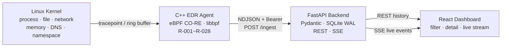
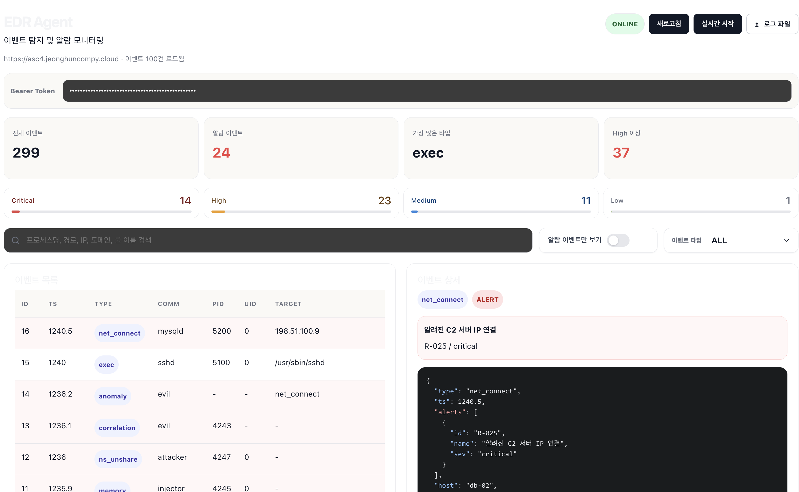
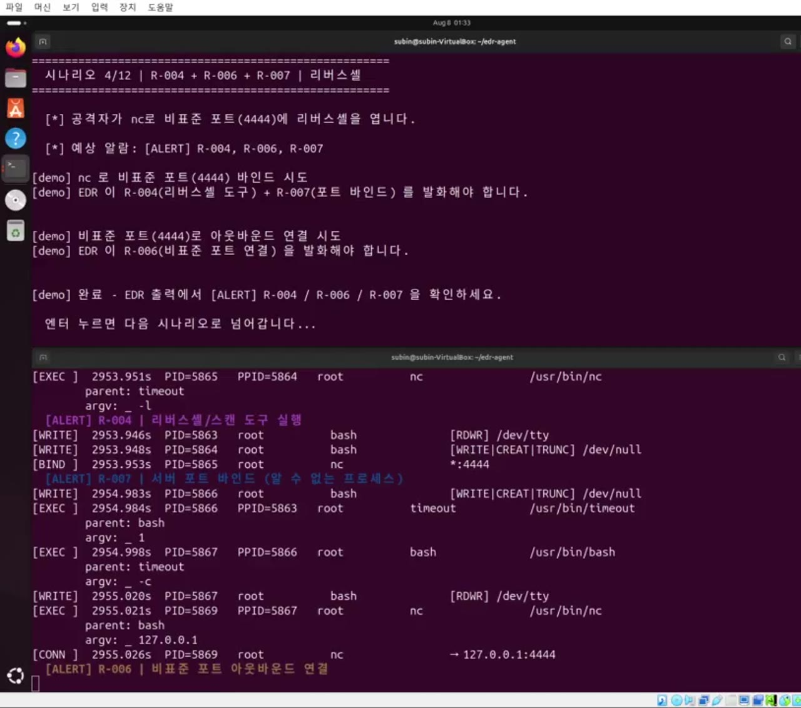
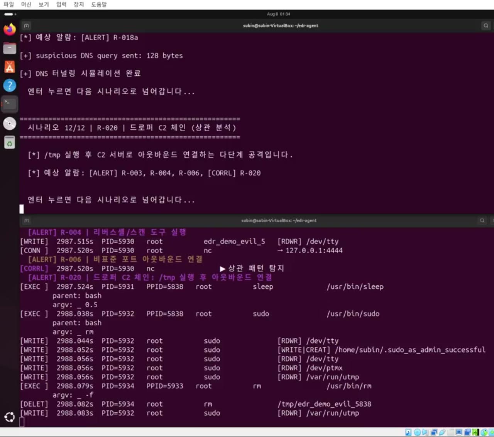
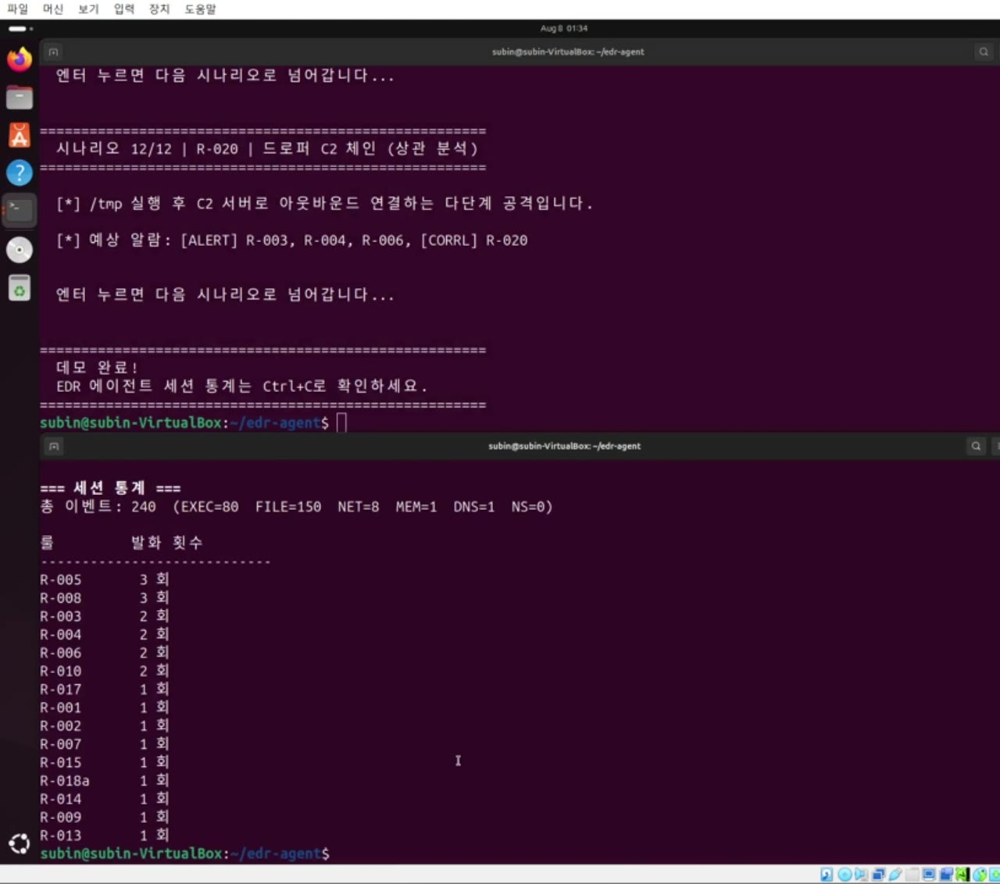

# ASC 프로젝트 최종 기술 보고서 — GhostRelay

- **팀:** 4조
- **참여 인원:** (팀장) 20233051 박도현, (팀원) 20253311 강수빈, 20261717 이정훈, 20241947 장수연
- **프로젝트 구분:** 기초 프로젝트(CL1)
- **진행 기간:** 2026. 03. 29. ~ 2026. 08. 15.
- **최종 발표:** 2026. 08. 15.
- **최종 결과물:** 리눅스 커널 행위를 eBPF로 수집하고 R-001~R-028 탐지 체계로 분석한 뒤, 웹 대시보드에 실시간으로 표시하는 EDR 프로토타입

## 1. 개요 및 목적

### 1.1 프로젝트 배경

처음에 단종된 ipTIME N2V 공유기의 공개 취약점 **CVE-2025-55423 UPnP Relay Command Injection**을 분석하는 프로젝트로 출발했다. 목표는 펌웨어를 추출하고 네트워크 입력이 명령 실행 함수까지 전달되는 경로를 정적·동적으로 확인하는 것이었다. 이 단계에서 팀은 binwalk, Wireshark, Ghidra를 사용해 펌웨어 내부의 UPnP 처리 흐름과 명령 주입 원인을 추적했다.

그러나 취약점 재현만으로는 공격 이후 호스트 내부에서 발생하는 프로세스 실행, 파일 변경, 외부 연결, 메모리 조작을 연속적으로 설명하기 어려웠다. 이 한계를 계기로 팀은 2026년 5월 프로젝트 주제를 변경했다.

최종 주제인 **GhostRelay**는 리눅스 커널에서 보안 관련 이벤트를 실시간 수집하고, 단일 행위와 연속 행위를 룰로 판정하며, 결과를 원격 관제 화면까지 전달하는 EDR(Endpoint Detection and Response) 프로토타입이다. 공격을 만드는 프로젝트가 아니라, 공격이 시스템에 남기는 흔적을 관찰하고 운영자가 이해할 수 있는 경고로 변환하는 것이 최종 목적이다.

### 1.2 문제 정의

일반 애플리케이션 로그만으로는 다음 문제를 해결하기 어렵다.

1. 공격자가 로그를 남기지 않는 바이너리나 셸을 실행하면 애플리케이션 로그에 기록되지 않을 수 있다.
2. 프로세스 실행, 파일 생성, 네트워크 연결이 서로 다른 로그에 흩어지면 하나의 공격 흐름으로 파악하기 어렵다.
3. 단일 이벤트만 보면 정상 관리 작업과 공격을 구분하기 어려워 오탐이 늘어난다.
4. 여러 호스트의 이벤트를 터미널에서만 확인하면 비개발자가 상태를 이해하기 어렵다.

따라서 최종 프로젝트는 다음 질문에 답하도록 설계했다.

> 리눅스 커널에서 공격 관련 행위를 낮은 지연으로 수집하고, 여러 이벤트의 관계를 판정해, 원격 웹 화면에서 즉시 확인할 수 있는가?

### 1.3 최종 목표와 완료 기준

| 목표 | 완료 기준 | 최종 결과 |
|---|---|---|
| 커널 이벤트 수집 | 프로세스·파일·네트워크·메모리·DNS·네임스페이스 6개 영역 수집 | 완료 |
| 탐지 판정 | 단일 룰, 상관분석, 위협 인텔리전스, 행동 이상 탐지 구현 | R-001~R-028 구현 |
| 원격 수집 | 에이전트 이벤트를 인증된 HTTP API로 전송·저장 | FastAPI + SQLite WAL 구현 |
| 실시간 관제 | 과거 이벤트 조회와 신규 이벤트 실시간 반영 | REST + SSE 대시보드 구현 |
| 실전 검증 | 안전한 시나리오로 기대 룰과 실제 발화를 대조 | 12개 시나리오, 15개 서로 다른 룰 발화 |
| 성능 근거 | 동일 워크로드에서 Agent OFF/ON 비교 | 3회 반복 최소 벤치마크 수행 |
| 재현 가능성 | 공개 소스, 설치·빌드·실행·검증 절차 제공 | 에이전트와 프론트엔드 공개, 실행 절차 수록 |

### 1.4 전체 진행 과정

| 단계 | 기간 | 주제 | 수행 내용 | 단계의 위치 |
|---|---|---|---|---|
| 1단계 | 03.29.~05.05. | ipTIME N2V 공개 CVE 선행 연구 | 펌웨어 추출, SSDP/UPnP 패킷 분석, `libcgi.so` 리버싱 | 최종 EDR의 문제의식이 된 선행 프로젝트 |
| 전환 | 05월 중순 | 문제 재정의 | 공격 이후 호스트 내부 행위 가시성 부족을 확인하고 주제 변경 | 선행 연구와 최종 프로젝트의 경계 |
| 2단계-A | 05.~06. | EDR 에이전트 | 6개 BPF 프로그램, 유저스페이스 수집기, 룰 엔진 구현 | 최종 프로젝트 핵심 |
| 2단계-B | 06.~07. | 백엔드·대시보드 | FastAPI 수집 API, SQLite, SSE, React 관제 화면 구현 | 최종 프로젝트 통합 |
| 2단계-C | 08. | 검증·배포·발표 | 12개 시나리오, 라이브 배포, 녹화 시연, 벤치마크, 발표 | 최종 결과 검증 |

## 2. 기술적 상세 분석

### 2.1 1단계 선행 연구 — ipTIME N2V 공개 취약점 분석

> 이 절은 최종 EDR 구현 이전에 수행한 **별도의 선행 연구 단계**이다. CVE를 새로 발견한 것이 아니라 이미 공개된 CVE-2025-55423의 원인을 펌웨어 수준에서 분석했다. 최종 산출물은 2.2절부터 설명한다.

#### 2.1.1 분석 환경과 대상

| 항목 | 내용 |
|---|---|
| 대상 | ipTIME N2V 펌웨어 12.16.8 |
| 아키텍처 | MIPS Big Endian 32-bit |
| 파일시스템 | Squashfs |
| 주요 라이브러리 | `/lib/libcgi.so` |
| 도구 | Kali Linux, binwalk, Wireshark, Ghidra 12.0.4 |

binwalk로 펌웨어를 풀어 Squashfs 파일시스템과 `libcgi.so`를 확보했다. Ghidra에 MIPS Big Endian 32-bit로 불러온 결과 1,345개 함수와 1,381개 심볼을 확인했다.


#### 2.1.2 네트워크 진입점 확인

UPnP 장치 탐색은 UDP 1900 포트의 SSDP를 사용한다. Wireshark에서 SSDP 트래픽을 필터링하고 NOTIFY 패킷의 LOCATION과 장치 설명 XML을 추적했다.


패킷과 `rootDesc.xml`을 통해 WAN 연결 제어 경로 `/ctl/IPConn`을 식별했다. 이후 SOAPAction 값이 펌웨어 내부의 어떤 처리 함수로 연결되는지 Ghidra에서 역추적했다.

#### 2.1.3 외부 입력에서 명령 실행까지의 흐름

`ExecuteSoapAction()`은 SOAPAction 문자열에서 `#` 뒤의 action 이름을 추출한 후 함수 포인터 테이블을 사용해 처리 함수로 분기한다. `AddPortMapping` 처리 과정에서는 `NewInternalClient`, `NewRemoteHost` 등 네트워크에서 전달된 값이 name-value list를 통해 사용된다.


핵심 문제는 상위 IGD 주소를 저장하고 재사용하는 경로에 있었다. `discover_upper_upnp_igd()`는 `/sbin/upnpc` 출력에서 `Found valid IGD`를 찾은 뒤 `http`로 시작하는 문자열을 충분히 검증하지 않고 상태값으로 저장한다. 이후 `upnp_relay()`가 해당 값을 문자열 명령에 삽입해 `system2()`로 실행한다.

```c
/* 디컴파일 결과에서 핵심 데이터 흐름만 단순화한 의사 코드 */
char *url = strstr(upnpc_output, "http");
snprintf(igd_url, sizeof(igd_url), "%s", url);
istatus_set_value_direct(&state, igd_url);

snprintf(option, sizeof(option), "-u %s", igd_url);
system2("/sbin/upnpc %s -m %s -d %s %s",
        option, iface, target, args);
```


전체 데이터 흐름은 다음과 같이 정리했다.

```text
공격자가 상위 IGD 탐색 경로를 가짜 UPnP 서버로 유도
  → 조작된 IGD URL이 포함된 응답 전달
  → discover_upper_upnp_igd()가 URL을 충분히 검증하지 않고 저장
  → AddPortMapping 과정에서 upnp_relay() 호출
  → 저장된 문자열이 system2()의 셸 명령 문자열에 결합
  → 셸 메타문자가 명령으로 해석될 가능성 발생
```

근본 원인은 외부 입력을 데이터 인자가 아니라 셸 명령 문자열의 일부로 사용한 것이다. 분석 결과를 바탕으로 URL의 스킴·호스트·포트 형식을 허용 목록으로 검증하고, `system()` 계열 대신 인자 배열을 직접 전달하는 `execvp()`/`execvpe()` 계열을 사용하는 방식을 개선 방향으로 정리했다.

#### 2.1.4 선행 연구의 결론과 주제 전환

이 단계에서 공개 취약점의 입력 경로와 위험 함수는 설명할 수 있었다. 그러나 명령이 실행된 뒤 어떤 프로세스가 만들어졌고, 어떤 파일을 변경했으며, 어느 주소로 연결했는지를 한 화면에서 연속적으로 보여주지는 못했다. 팀은 이 문제를 최종 프로젝트의 요구사항으로 전환했다.

즉, **1단계의 결과물은 공유기 취약점 분석**이고, **2단계의 결과물은 그 과정에서 발견한 가시성 문제를 해결하는 리눅스 EDR**이다. 두 단계는 기술적으로 이어지지만 동일한 프로젝트 구현물은 아니다.

### 2.2 2단계 최종 프로젝트 — GhostRelay EDR

#### 2.2.1 시스템 구성과 데이터 흐름

GhostRelay는 에이전트, 수집 백엔드, 웹 대시보드의 세 계층으로 구성된다.



1. 커널의 tracepoint에서 프로세스·파일·네트워크 등의 이벤트를 관찰한다.
2. BPF 프로그램이 정형 이벤트를 ring buffer에 기록한다.
3. C++ 유저스페이스 에이전트가 이벤트를 읽고 룰·상관분석·위협 인텔리전스·이상탐지를 적용한다.
4. 결과를 NDJSON으로 직렬화하고 Bearer 토큰과 함께 백엔드 `/ingest`로 전송한다.
5. 백엔드는 이벤트를 검증해 SQLite에 저장하고 REST와 SSE로 제공한다.
6. React 대시보드는 기존 이벤트를 REST로 읽고 신규 이벤트를 SSE로 받아 즉시 화면에 추가한다.

#### 2.2.2 개발 및 실행 환경

| 계층 | 환경과 기술 |
|---|---|
| 에이전트 | Ubuntu 22.04 이상, Linux 5.8 이상, C++17, clang/LLVM, CMake, libbpf, eBPF CO-RE, libcurl |
| 커널 요구사항 | BTF(`/sys/kernel/btf/vmlinux`), BPF ring buffer, tracefs 접근 |
| 백엔드 | Python 3.11 이상, FastAPI, Pydantic, SQLite WAL, asyncio SSE |
| 프론트엔드 | React 19, Vite 8, Fetch API, ReadableStream |
| 배포 | 에이전트 Docker privileged, 백엔드 Cloudflare Tunnel, 프론트엔드 Cloudflare Pages |
| 전송 형식 | NDJSON over HTTP(S), Bearer 인증 |

### 2.3 eBPF 엔드포인트 에이전트

#### 2.3.1 수집 영역과 커널 훅

에이전트는 하나의 거대한 BPF 프로그램 대신 관찰 목적에 따라 6개 프로그램으로 나눴다.

| 영역 | 주요 훅·시스템 호출 | 수집 필드 | 탐지 예시 |
|---|---|---|---|
| 프로세스 | `sched_process_exec`, `sched_process_exit`, `sys_enter_execve` | PID, PPID, UID, 경로, argv, 부모 프로세스 | 임시 경로 실행, 인터프리터 인라인 실행 |
| 파일 | `openat`, `unlinkat`, `renameat2` | 경로, 플래그, 생성·삭제·이동 | 시스템 경로 수정, 로그 삭제, `/tmp`→`/etc` 이동 |
| 네트워크 | `connect`, `bind` | IPv4/IPv6 주소, 포트 | 비표준 포트 연결, 미지 서버 바인드 |
| 메모리 | `mmap`, `mprotect`, `memfd_create`, ptrace | 보호 플래그, memfd 이름, 추적 대상 | RWX 메모리, 파일리스 실행, 프로세스 추적 |
| DNS | UDP 53 `sendto` | QNAME, 레이블 길이, TLD | DNS 터널링, DGA, 남용 TLD |
| 네임스페이스 | `unshare`, PID namespace inum | namespace flags, 컨테이너 여부 | 컨테이너 내부 분리·탈출 징후 |

CO-RE(Compile Once, Run Everywhere)는 빌드 시 생성한 BPF 프로그램이 실행 호스트의 BTF 정보를 이용해 커널 구조체 오프셋 차이를 보정하도록 한다. 단, 모든 커널에서 무조건 동작한다는 뜻은 아니며 BTF와 필요한 tracepoint가 존재해야 한다.

#### 2.3.2 argv 캡처 문제와 해결

`python3 -c "..."`처럼 파일 없이 인자로 전달되는 페이로드를 탐지하려면 실행 파일 경로뿐 아니라 argv가 필요하다. 처음에는 실행이 확정되는 `sched_process_exec`에서 argv를 읽으려 했지만, 이 시점에는 이전 프로세스의 유저 메모리가 교체돼 인자 포인터를 안정적으로 읽을 수 없었다.

해결 방식은 두 훅의 장점을 결합하는 것이다.

```text
sys_enter_execve
  1. 아직 유저 argv가 유효할 때 제한된 개수와 길이로 복사
  2. PID를 키로 BPF map에 임시 저장

sched_process_exec
  3. exec 성공 시 실행 경로와 임시 argv를 결합
  4. 완성된 EXEC 이벤트를 ring buffer로 제출
  5. 임시 map 항목 삭제
```

실패한 `execve()`도 정리 경로에서 map 항목을 제거해 오래된 인자가 다른 실행에 붙지 않도록 했다. 이 구조로 R-010 인터프리터 인라인 페이로드 탐지가 가능해졌다.

#### 2.3.3 BPF Verifier 제약과 DNS 파서

커널의 BPF Verifier는 프로그램이 무한 루프, 범위 밖 메모리 접근, 검증되지 않은 포인터 연산을 수행하지 않는지 로드 전에 검사한다. DNS QNAME은 길이가 가변적이므로 일반 C 파서처럼 종료 문자를 만날 때까지 순회하면 검증에 실패할 수 있다.

따라서 DNS 파서는 다음 제약을 적용했다.

- 반복 횟수와 읽을 수 있는 패킷 범위를 상수로 제한한다.
- 각 레이블 길이가 DNS 규격의 최대 범위를 넘는지 확인한다.
- 패킷 끝을 넘기 전에 루프를 종료한다.
- 유저스페이스에 전달할 문자열 길이를 구조체 크기 이내로 제한한다.

이 방식은 완전한 범용 DNS 파서보다 기능 범위가 좁지만, 탐지에 필요한 QNAME을 안전하게 추출하고 Verifier를 통과시키는 데 목적이 있다.

#### 2.3.4 프로세스 관계 추적

웹 서버나 데이터베이스 서버가 자식 셸을 실행하는 행위는 단순히 `bash`가 실행됐다는 사실보다 부모·자식 관계가 중요하다. 에이전트는 유저스페이스 `ProcTree`에 PID, PPID, 프로세스 이름을 저장한다.

에이전트가 시작되기 전에 이미 실행 중인 `nginx`, `apache`, `mysqld`, `postgres` 같은 데몬도 판정할 수 있도록 시작 시 `/proc`을 스캔해 초기 트리를 만든다. 이후 exec 이벤트에서 갱신하고 exit 이벤트에서 제거한다. 제거 처리는 PID 재사용으로 과거 부모 관계가 새 프로세스에 잘못 적용되는 문제를 줄인다.

#### 2.3.5 탐지 룰 체계

프로젝트는 번호 기준으로 R-001~R-028의 28개 탐지 패턴을 정의했다. R-018은 DNS 조건에 따라 a/b/c 세부 규칙을 가진다.

| ID | 탐지 대상 | 핵심 조건 | 심각도 |
|---|---|---|---|
| R-001 | 시스템 경로 파일 수정 | `/etc`, `/bin`, `/sbin` 등 중요 경로 쓰기 | high |
| R-002 | 로그 삭제 | `/var/log` 등 로그 경로 삭제 | high |
| R-003 | 임시 경로 실행 | `/tmp` 등에서 바이너리 실행 | high |
| R-004 | 리버스셸·스캔 도구 | `nc`, `socat`, `nmap` 등 지정 도구 실행 | critical |
| R-005 | 스크립트 인터프리터 | python, perl, ruby 등 실행 | medium |
| R-006 | 비표준 포트 연결 | 허용 목록 밖 아웃바운드 포트 | medium |
| R-007 | 미지 프로세스 바인드 | 허용되지 않은 프로세스의 서버 포트 바인드 | low |
| R-008 | root 인터프리터 | UID 0의 스크립트 인터프리터 실행 | critical |
| R-009 | 임시→시스템 경로 이동 | `/tmp` 파일을 시스템 경로로 rename | critical |
| R-010 | 인라인 페이로드 | 인터프리터의 `-c`, `-e` 인자 | high |
| R-011 | 웹 서버 자식 셸 | 웹 서버 계열 부모 아래 셸 실행 | critical |
| R-012 | DB 서버 자식 셸 | DB 서버 계열 부모 아래 셸 실행 | critical |
| R-013 | `LD_PRELOAD` | 환경변수를 이용한 라이브러리 주입 징후 | high |
| R-014 | ptrace attach | 다른 프로세스 추적·주입 시도 | high |
| R-015 | 예상 밖 setuid 실행 | 허용 목록 밖 setuid 바이너리 실행 | critical |
| R-016 | RWX 메모리 | 쓰기와 실행 권한을 동시에 가진 메모리 | high |
| R-017 | `memfd_create` | 디스크 파일 없이 메모리 파일 생성·실행 | critical/high |
| R-018a | DNS 터널링 | 50자를 넘는 긴 DNS 레이블 | critical |
| R-018b | DGA 의심 | 랜덤성이 높고 모음 비율이 낮은 서브도메인 | high |
| R-018c | 남용 TLD | 설정된 고위험 TLD 질의 | medium |
| R-019 | ptrace↔memfd | 같은 PID에서 30초 안에 두 이벤트 결합 | critical |
| R-020 | 임시 실행↔외부 연결 | 같은 PID에서 60초 안에 두 이벤트 결합 | critical |
| R-021 | 임시 파일 쓰기→실행 | 같은 PID에서 60초 안에 순서 결합 | critical |
| R-022 | RWX↔외부 연결 | 같은 PID에서 30초 안에 두 이벤트 결합 | critical |
| R-023 | 의심 DNS↔외부 연결 | 같은 PID에서 30초 안에 두 이벤트 결합 | high |
| R-024 | 컨테이너 탈출 징후 | 컨테이너 내부 `unshare`와 namespace 비교 | critical/high |
| R-025 | 알려진 C2 IP | Feodo Tracker IP 대조 | critical |
| R-026 | 알려진 악성 도메인 | URLhaus 도메인 대조 | critical |
| R-027 | 알려진 악성 파일 | SHA-256 해시 목록 대조 | critical |
| R-028 | 행동 빈도 이상 | exec/connect/write EWMA 기반 Z-score | high |

#### 2.3.6 상관분석

단일 이벤트는 정상 행위일 수 있다. `/tmp`의 개발용 바이너리 실행이나 비표준 포트 연결은 각각 오탐 가능성이 있지만, 같은 프로세스가 짧은 시간 안에 두 행위를 연속 수행하면 위험도가 높아진다.

유저스페이스 상관분석기는 PID별 이벤트를 `deque`에 저장하고 30~60초 슬라이딩 윈도우 안에서 조합을 확인한다.

```cpp
if (kind == CorrelEvt::NET_CONN &&
    seen(pid, CorrelEvt::EXEC_TMP, ts_ns, W60)) {
    hits.push_back({"R-020",
        "드로퍼 C2 체인: /tmp 실행 후 아웃바운드 연결",
        "critical"});
}
```

R-020의 판정 흐름은 다음과 같다.

```text
/tmp/edr_demo_payload 실행 → EXEC_TMP 기록(R-003)
  → 동일 PID가 60초 안에 비표준 포트로 connect(R-006)
  → 두 사건을 R-020 드로퍼-C2 체인으로 결합
  → severity를 critical로 표시
```

#### 2.3.7 위협 인텔리전스와 행동 이상 탐지

`FeedManager`는 백그라운드에서 Feodo Tracker와 URLhaus 피드를 갱신하고, 네트워크·DNS 이벤트를 알려진 악성 지표와 비교한다. R-027은 로컬 SHA-256 목록과 실행 파일의 해시를 대조한다. 외부 피드를 사용할 수 없더라도 기본 이벤트 수집과 정적 룰은 계속 동작하도록 분리했다.

R-028은 프로세스별 exec, network connect, file write 빈도를 60초 단위로 기록하고 EWMA를 사용해 최근 평균과 편차를 갱신한다. 학습 표본이 최소 개수에 도달한 뒤 Z-score가 임계값 이상이면 이상 행위로 판정한다. 이는 머신러닝 모델을 학습한 기능이 아니라, 계산 비용이 낮은 통계 기반 기준선이다.

#### 2.3.8 오탐과 중복 억제

보안 이벤트를 모두 경고로 표시하면 정상 패키지 설치나 관리 작업이 화면을 채운다. 프로젝트는 다음 두 층에서 노이즈를 줄였다.

- YAML 설정에서 룰별 정상 프로세스, 경로, 포트를 허용한다.
- 동일한 `(rule_id, comm)` 조합이 3초 안에 반복되면 중복 경고를 억제한다.

화이트리스트는 전체 탐지를 끄는 전역 목록이 아니라 룰 문맥별로 적용한다. 예를 들어 `apt`와 `dpkg`의 시스템 경로 쓰기는 허용하더라도 다른 프로세스의 동일 행위는 계속 탐지한다.

#### 2.3.9 출력과 능동 대응

에이전트는 터미널 표, NDJSON 파일, HTTP POST 출력을 지원한다. `SIGINT`나 `SIGTERM`을 받으면 이벤트 유형별 카운터와 룰별 발화 횟수를 출력하고 종료한다.

Unix 도메인 소켓을 통한 `ping`, `status`, `kill <pid> [signal]` 명령도 구현했다. 다만 최종 웹 대시보드는 읽기 전용이며, 소켓 대응 기능이 원격 웹 API와 연결된 것은 아니다. 이 구분은 프로젝트의 실제 구현 범위를 명확히 하기 위해 중요하다.

### 2.4 수집 백엔드

#### 2.4.1 이벤트 모델

백엔드는 Python 3.11 이상과 FastAPI로 구현했다. `type` 필드를 판별자로 사용하는 Pydantic discriminated union으로 다음 13종 이벤트를 검증한다.

```text
exec, file_write, file_delete, file_rename,
net_connect, net_bind, dns, ptrace, memfd,
memory, ns_unshare, anomaly, correlation
```

원본 이벤트 JSON은 보존하면서 알림은 별도 구조로 저장해, 이벤트 상세와 룰·심각도 집계를 함께 제공한다. SQLite는 WAL 모드를 사용해 수집 쓰기와 대시보드 읽기가 겹칠 때의 잠금 충돌을 줄였다.

#### 2.4.2 API 계약

2026년 8월 16일 배포된 OpenAPI 0.2.0에서 확인한 엔드포인트는 다음과 같다.

| 메서드·경로 | 용도 |
|---|---|
| `GET /health` | 서버 상태 확인 |
| `POST /ingest` | 에이전트 호환 NDJSON 수집 |
| `POST /api/v1/events` | 이벤트 1건 수집 |
| `POST /api/v1/events/batch` | JSON 배열 배치 수집 |
| `POST /api/v1/events/ndjson` | 엄격한 NDJSON 수집 |
| `GET /api/v1/events` | 이벤트 검색·필터·페이지 조회 |
| `GET /api/v1/events/{event_id}` | 이벤트 상세 조회 |
| `GET /api/v1/alerts` | 심각도별 알림 조회 |
| `GET /api/v1/alerts/summary` | 심각도별 알림 집계 |
| `GET /api/v1/events/stream` | SSE 실시간 이벤트 스트림 |

#### 2.4.3 수집 경로 이원화와 poison-pill 방지

NDJSON 배치에서 한 줄이 스키마를 위반했을 때 전체 요청을 무조건 실패시키면, 에이전트가 같은 배치를 재전송하면서 뒤쪽 정상 이벤트까지 전달되지 않는 poison-pill 문제가 생길 수 있다.

| 경로 | 대상 | 정책 | 응답 방식 |
|---|---|---|---|
| `/ingest` | 운영 에이전트 | 관대 모드 | 잘못된 줄만 건너뛰고 accepted/skipped 수 반환 |
| `/api/v1/events/ndjson` | API 클라이언트·검증 | 엄격 모드 | 한 줄이라도 위반하면 422 반환 |

이원화로 운영 수집의 연속성과 API 검증의 엄격함을 동시에 유지했다.

#### 2.4.4 실시간 스트림과 보안

`EventBroadcaster`는 구독자별 asyncio 큐를 생성하고 저장된 신규 이벤트를 SSE로 팬아웃한다. 15초 하트비트로 연결 상태를 유지하고 서버 측 필터와 최대 구독자 수 제한을 적용했다.

보안 측면에서는 Bearer 토큰을 ingest/read/admin 범위로 분리하고, 수집 요청의 본문 크기 제한, 슬라이딩 윈도우 레이트리밋, 허용 오리진 기반 CORS, 보안 응답 헤더를 적용했다. 보고서와 저장소에는 실제 토큰을 포함하지 않는다.

### 2.5 웹 대시보드

#### 2.5.1 화면 구성

프론트엔드는 React 19와 Vite로 구현했다. 주요 화면 요소는 다음과 같다.

- API 연결 상태와 실시간 스트림 상태 표시
- 전체 이벤트, 알림 이벤트, 심각도별 통계 타일
- 이벤트 유형, 심각도, 알림 여부, 검색어 필터
- 이벤트 목록과 선택 이벤트의 원본 필드·알림 상세
- REST 초기 조회 후 SSE 신규 이벤트 실시간 반영



브라우저 기본 `EventSource`는 Authorization 헤더를 직접 넣기 어렵다. 대시보드는 `fetch()`로 SSE 요청을 보내고 `ReadableStream`을 직접 파싱해 Bearer 인증과 실시간 수신을 함께 처리했다.

#### 2.5.2 배포 오류와 해결 과정

Cloudflare Pages 배포 후 API 요청이 `Unexpected token '<'`로 실패했다. 이 오류는 JSON을 기대한 코드가 HTML의 첫 문자 `<`를 읽을 때 발생한다.

조사 결과 `/edr-api/*` 요청이 백엔드로 프록시되지 않고 React SPA의 `index.html`로 처리되고 있었다. 프론트 저장소에 있던 `vercel.json` 프록시 설정은 Vercel용이므로 Cloudflare Pages에서 적용되지 않았다.

해결은 다음과 같았다.

1. 로컬 개발은 Vite의 `/edr-api` 프록시를 유지한다.
2. 프로덕션 빌드는 `https://asc4.jeonghuncompy.cloud`로 직접 요청한다.
3. 백엔드는 `https://ebpf-agent.com` 오리진을 CORS 허용 목록에 추가한다.
4. 재배포 후 브라우저 캐시를 강력 새로고침해 이전 번들 사용 여부를 배제한다.

환경변수 오류로 의심했던 일부 현상은 실제로 이전 JS 번들이 브라우저 캐시에 남아 발생했다. 이를 통해 배포 설정과 클라이언트 캐시를 분리해 확인해야 한다는 점을 확인했다.

## 3. 최종 결과물

### 3.1 공개 산출물

| 산출물 | 내용 | 공개 위치 |
|---|---|---|
| EDR 에이전트 | C++/eBPF 소스, 28개 룰, 설정, 데모, systemd 파일 | [GitHub — edr-agent](https://github.com/no-carve-only-pizza/edr-agent) |
| 프론트엔드 | React/Vite 대시보드 소스 | [GitHub — edr-agent-frontend](https://github.com/COMPY07/edr-agent-frontend) |
| 배포 대시보드 | 라이브 관제 화면 | [ebpf-agent.com](https://ebpf-agent.com) |
| 백엔드 API 명세 | FastAPI Swagger/OpenAPI 0.2.0 | [Swagger UI](https://asc4.jeonghuncompy.cloud/docs) |
| 프로젝트 보고서 제출 저장소 | ASC 보고서 관리 저장소 | [ProjectDB](https://github.com/ssu-asc/ProjectDB) |

백엔드 구현 소스는 2026년 8월 16일 기준 위 두 공개 GitHub 계정의 공개 저장소에서 확인되지 않았다. 따라서 본 보고서는 백엔드를 공개 소스로 재구축할 수 있다고 주장하지 않는다. 백엔드 기능은 배포된 Swagger/OpenAPI 명세와 통합 시연 결과로 검증하며, 제3자가 소스만으로 완전히 재현할 수 있는 범위는 에이전트와 프론트엔드다.

### 3.2 에이전트 단독 재현 절차

아래 절차는 Ubuntu 22.04 이상과 BTF를 제공하는 Linux 5.8 이상 커널을 기준으로 한다. 테스트는 루트 권한으로 커널 추적 프로그램을 로드하므로 개인 실습용 VM 또는 별도 테스트 호스트에서 수행해야 한다.

#### 3.2.1 사전 확인

```bash
uname -r
test -r /sys/kernel/btf/vmlinux && echo "BTF available"
```

두 번째 명령에서 `BTF available`이 출력되지 않으면 CO-RE BPF 프로그램 로드가 실패할 수 있다.

#### 3.2.2 의존성 설치

```bash
sudo apt update
sudo apt install -y \
  clang llvm libbpf-dev libelf-dev zlib1g-dev \
  libcurl4-openssl-dev linux-tools-$(uname -r) \
  cmake pkg-config git
```

#### 3.2.3 소스 내려받기와 Release 빌드

```bash
git clone https://github.com/no-carve-only-pizza/edr-agent.git
cd edr-agent
cmake -B build -S . -DCMAKE_BUILD_TYPE=Release
cmake --build build -j"$(nproc)"
```

정상 빌드 후 `build/edr-agent` 실행 파일이 생성된다.

```bash
test -x build/edr-agent && echo "build ok"
```

#### 3.2.4 로컬 실행

```bash
sudo ./build/edr-agent --rules config/rules.yaml
```

정상 실행 시 배너와 이벤트 테이블이 출력되고 프로세스·파일·네트워크 이벤트가 나타난다. 다른 터미널에서 다음과 같이 안전한 확인 이벤트를 만든다.

```bash
cp /bin/true /tmp/edr_report_test
chmod +x /tmp/edr_report_test
/tmp/edr_report_test
rm -f /tmp/edr_report_test
```

에이전트 터미널에서 `/tmp/edr_report_test` 실행 이벤트와 R-003 경고가 나타나면 프로세스 수집과 기본 룰 판정이 동작한 것이다. `Ctrl+C`로 종료하면 세션 통계가 출력된다.

#### 3.2.5 NDJSON 파일 출력

```bash
sudo mkdir -p /var/log/edr
sudo ./build/edr-agent \
  --rules config/rules.yaml \
  --log /var/log/edr/events.ndjson
```

별도 터미널에서 이벤트를 만든 뒤 다음 명령으로 JSON 한 줄 단위 출력 여부를 확인한다.

```bash
sudo tail -n 5 /var/log/edr/events.ndjson
```

#### 3.2.6 백엔드 연동

실제 토큰은 저장소나 명령 기록에 남기지 않고 환경변수로 주입한다.

```bash
read -rsp "Ingest token: " EDR_INGEST_TOKEN
echo
sudo ./build/edr-agent \
  --rules config/rules.yaml \
  --endpoint https://asc4.jeonghuncompy.cloud/ingest \
  --token "$EDR_INGEST_TOKEN" \
  --alerts-only
unset EDR_INGEST_TOKEN
```

배포 서버와 유효한 ingest 토큰이 있어야 이 단계가 성공한다. 서버가 종료됐거나 토큰이 없으면 3.2.4의 로컬 출력과 3.2.5의 NDJSON 출력까지만 재현할 수 있다.

#### 3.2.7 능동 대응 확인

에이전트를 기본 소켓 경로로 실행한 상태에서 다음을 수행한다.

```bash
chmod +x demo/edr-ctl.sh
./demo/edr-ctl.sh ping
./demo/edr-ctl.sh status
```

정상 응답 예시는 다음과 같다.

```json
{"ok":true,"msg":"pong"}
```

`kill` 명령은 실제 프로세스에 시그널을 보내므로 테스트용으로 직접 생성한 PID에만 사용해야 한다.

### 3.3 12개 공격 시나리오 재현 절차

공개 저장소의 `demo/run_demo_final.sh`는 실제 외부 공격 대상을 사용하지 않고 로컬 마커 파일과 테스트 프로세스로 룰 발화를 확인한다. `/etc`, `/var/log`, setuid 파일을 일시적으로 사용하므로 반드시 폐기 가능한 Ubuntu VM에서 실행한다. 스크립트는 각 시나리오 종료 후 생성한 마커를 삭제한다.

터미널 1에서 에이전트를 시작한다.

```bash
cd edr-agent
sudo ./build/edr-agent --rules config/rules.yaml
```

터미널 2에서 데모를 실행한다.

```bash
cd edr-agent
sudo bash demo/run_demo_final.sh
```

| 순서 | 재현 행위 | 기대 룰 |
|---:|---|---|
| 1 | `/etc`에 마커 파일 생성 | R-001 |
| 2 | `/var/log`의 테스트 로그 삭제 | R-002 |
| 3 | `/tmp`에 복사한 테스트 바이너리 실행 | R-003 |
| 4 | 로컬 비표준 포트 연결·바인드 | R-004, R-006, R-007 |
| 5 | `python3 -c`, `perl -e` 인라인 실행 | R-005, R-010 |
| 6 | `/tmp` 마커를 `/etc`로 이동 | R-009 |
| 7 | 테스트용 `LD_PRELOAD` 행위 | R-013 |
| 8 | 테스트 프로세스 ptrace | R-014 |
| 9 | 임시 setuid 테스트 바이너리 실행 | R-015 |
| 10 | `memfd_create` 파일리스 실행 | R-017 |
| 11 | 긴 로컬 DNS 질의 | R-018 |
| 12 | `/tmp` 실행 후 로컬 비표준 포트 연결 | R-003, R-004, R-006, R-020 |

각 단계에서 터미널의 `[ALERT] R-xxx`와 마지막 `[CORRL] R-020`을 기대값과 대조한다. 종료 후 `Ctrl+C`로 에이전트를 정지하고 세션 통계를 확인한다.

### 3.4 프론트엔드 로컬 실행

프론트엔드는 Node.js와 npm이 설치된 환경에서 다음과 같이 실행한다.

```bash
git clone https://github.com/COMPY07/edr-agent-frontend.git
cd edr-agent-frontend
npm ci
cp .env.example .env
npm run dev
```

로컬 개발의 기본 API 경로는 `/edr-api`이며 Vite 프록시가 `EDR_API_PROXY_TARGET`으로 전달한다. 로컬 백엔드가 없다면 `.env`에 공개 배포 주소를 지정할 수 있다.

```dotenv
VITE_EDR_API_BASE_URL=https://asc4.jeonghuncompy.cloud
```

이후 브라우저에서 Vite가 출력한 로컬 URL을 열고 read 권한 토큰을 입력한다. 유효한 토큰이 없으면 UI 빌드와 화면 렌더링은 확인할 수 있지만 실제 이벤트 조회와 SSE 수신은 확인할 수 없다.

프로덕션 빌드 자체는 다음 명령으로 검증한다.

```bash
npm run lint
npm run build
npm run preview
```

### 3.5 통합 동작 확인 기준

처음 프로젝트를 실행하는 사람은 다음 순서로 각 계층을 분리해 확인하면 문제 위치를 좁힐 수 있다.

| 확인 순서 | 명령·화면 | 성공 기준 |
|---:|---|---|
| 1 | `GET https://asc4.jeonghuncompy.cloud/health` | HTTP 200과 상태 JSON |
| 2 | 에이전트 로컬 실행 | BPF 프로그램 로드 후 이벤트 출력 |
| 3 | `/tmp` 테스트 바이너리 실행 | EXEC 이벤트와 R-003 출력 |
| 4 | NDJSON 파일 출력 | 한 줄에 JSON 객체 하나씩 기록 |
| 5 | 인증된 `/ingest` 전송 | 서버가 accepted/skipped 결과 반환 |
| 6 | 대시보드 REST 조회 | 전송한 이벤트가 목록에 나타남 |
| 7 | SSE 활성화 후 새 이벤트 생성 | 새 이벤트가 새로고침 없이 추가됨 |

### 3.6 재현 중 자주 발생하는 오류

| 증상 | 확인할 항목 | 해결 방법 |
|---|---|---|
| BPF 프로그램 로드 실패 | `/sys/kernel/btf/vmlinux` 존재 여부, 커널 로그 | BTF 지원 Ubuntu 커널을 사용하고 `sudo dmesg`의 Verifier 오류를 확인한다. |
| `Operation not permitted` | 실행 권한과 컨테이너 권한 | 호스트에서는 `sudo`로 실행하고, Docker에서는 BTF·tracefs 마운트와 필요한 권한을 확인한다. |
| 이벤트가 출력되지 않음 | 에이전트 실행 상태와 테스트 행위 | 먼저 `/tmp` 테스트 바이너리 실행으로 EXEC 수집부터 분리 확인한다. |
| HTTP 401/403 | 토큰 값과 scope | ingest에는 ingest scope, 대시보드 조회에는 read scope 토큰을 사용한다. 토큰은 소스나 보고서에 기록하지 않는다. |
| 대시보드에서 `Unexpected token '<'` | API 응답 Content-Type과 본문 | API 경로가 SPA HTML로 처리되는지 확인하고 `VITE_EDR_API_BASE_URL`을 실제 백엔드 주소로 지정한다. |
| 브라우저만 이전 동작을 보임 | 배포된 번들과 브라우저 캐시 | 개발자 도구에서 요청 URL을 확인하고 강력 새로고침 후 다시 검사한다. |
| SSE는 연결되지만 새 이벤트가 없음 | REST 조회, 서버 스트림, 에이전트 전송을 각각 확인 | REST에 이벤트가 저장되는지 먼저 확인한 후 SSE 연결과 필터 조건을 확인한다. |

## 4. 실전 입증 및 성과

### 4.1 기능 검증 결과

최종 발표용 녹화 시연에서는 12개 시나리오를 순서대로 실행하고 기대 룰과 에이전트 출력을 대조했다. 결과는 다음과 같다.

| 항목 | 결과 |
|---|---:|
| 실행한 시나리오 | 12개 |
| 수집 이벤트 | 240개 |
| 이벤트 구성 | EXEC 80, FILE 150, NET 8, MEM 1, DNS 1 |
| 발화한 서로 다른 룰 | 15개 |
| 확인한 상관분석 | R-020 드로퍼-C2 체인 |

다음 화면은 개별 룰이 출력되는 시연 과정이다.



마지막 시나리오에서는 `/tmp` 실행과 비표준 포트 연결이 동일 PID와 60초 조건을 충족해 R-020으로 결합됐다.



종료 시 출력한 세션 통계로 전체 이벤트 수와 룰 발화를 확인했다.



이 결과는 정의한 테스트 입력에서 룰이 발화하는지를 확인한 기능 검증이다. 실제 기업 환경의 공격 탐지율이나 오탐률을 측정한 성능 평가는 아니다.

### 4.2 Agent→Backend→Dashboard 통합 검증

2026년 8월 4일 배포 화면에서 다음 상태를 확인했다.

| 항목 | 확인값 |
|---|---:|
| 전체 이벤트 | 299건 |
| 알림 포함 이벤트 | 24건 |
| Critical 알림 | 14건 |
| High 알림 | 23건 |
| Medium 알림 | 11건 |
| Low 알림 | 1건 |

알림 수 합계가 알림 포함 이벤트 수보다 큰 이유는 하나의 이벤트가 여러 룰에 동시에 매칭될 수 있기 때문이다. 상세 패널에서 `net_connect` 이벤트가 R-025 "알려진 C2 서버 IP 연결" critical로 표시되는 것을 확인해, 에이전트 판정 → 백엔드 저장 → 대시보드 시각화 전 구간이 연결됐음을 검증했다.


### 4.3 최소 성능 벤치마크

#### 4.3.1 환경

2026년 8월 16일 최종 에이전트 소스 커밋 `9463245`를 별도 Ubuntu 호스트에 복사해 Release로 빌드했다.

| 항목 | 값 |
|---|---|
| OS | Ubuntu 24.04.4 LTS |
| 커널 | Linux 7.0.0-28-generic x86_64 |
| CPU | 12 logical CPUs |
| RAM | 30 GiB |
| 컴파일러 | clang 18.1.3 |
| libbpf / bpftool | 1.3.0 / 7.7.0 |

먼저 10초 스모크 테스트로 6개 BPF 프로그램의 로드·attach·정상 종료를 확인했다. 이후 다음 조건으로 Agent OFF/ON을 비교했다.

- 1,000개 파일 생성과 삭제를 500회 반복한다.
- 실행 1회당 기대 FILE 이벤트는 1,000,000개다.
- Agent OFF와 ON을 각각 3회 수행한다.
- `/usr/bin/time`으로 wall time을 측정한다.
- Agent ON 표준 출력은 `/dev/null`로 보내 터미널 출력 비용을 제외한다.
- idle 상태는 `pidstat` 1초 간격 60개 표본으로 측정한다.

#### 4.3.2 실행시간 결과

| 상태 | 1회 | 2회 | 3회 | 평균 | 중앙값 |
|---|---:|---:|---:|---:|---:|
| Agent OFF | 4.22s | 4.23s | 4.22s | **4.223s** | 4.22s |
| Agent ON | 5.22s | 5.21s | 5.18s | **5.203s** | 5.21s |

- 평균 wall time 증가: **23.20%**
- 중앙값 wall time 증가: **23.46%**
- 워크로드가 생성하는 기대 FILE 이벤트 환산율: OFF 약 236,780 events/s, ON 약 192,185 events/s

이 수치는 “일반적인 프로그램이 23.20% 느려진다”는 뜻이 아니다. 대량의 파일 생성·삭제만 연속 수행하는 인위적인 스트레스 워크로드에서 에이전트 유무에 따른 wall time 차이다.

#### 4.3.3 자원 사용량

| 구간 | 에이전트 CPU 평균 | CPU 최대 | RSS 평균·최대 |
|---|---:|---:|---:|
| idle 60초 | **0.017%** | 1.00% | **36,820 KiB (35.96 MiB)** |
| 파일 워크로드 16초 | **29.625%** | 32.00% | **36,820 KiB (35.96 MiB)** |

`pidstat`의 CPU 100%는 논리 CPU 하나를 기준으로 한다. 부하 구간 평균 29.625%는 12 logical CPU 전체 용량을 기준으로 약 2.47%다.

#### 4.3.4 이벤트 카운터 확인

Agent ON 3회 전후 카운터 차이는 다음과 같다.

| 유형 | 증가량 |
|---|---:|
| FILE | 3,001,013 |
| EXEC | 2,167 |
| NET | 113 |
| MEM | 264 |
| DNS | 16 |
| NS | 0 |
| TOTAL | 3,003,573 |

워크로드의 기대 FILE 이벤트 3,000,000개보다 1,013개 많았다. 이는 백그라운드 Docker와 시스템 파일 활동도 함께 수집됐기 때문이다. 기대값보다 적지 않았다는 사실은 확인했지만, 이 값으로 ring-buffer drop rate를 0%라고 계산할 수는 없다. 정확한 드롭률은 BPF의 ring-buffer reserve 실패 횟수를 별도 카운터로 계측해야 한다.

### 4.4 기술적 성과 요약

1. 6개 영역의 커널 이벤트를 하나의 에이전트에서 동시에 수집했다.
2. 실행 직전 argv 저장과 실행 성공 이벤트 결합으로 파일리스 인라인 명령 탐지를 구현했다.
3. 단일 이벤트를 넘어서 PID와 시간 창을 기준으로 5개 다단계 상관 패턴을 탐지했다.
4. 위협 인텔리전스와 EWMA 기반 행동 기준선을 정적 룰과 결합했다.
5. 관대·엄격 수집 경로를 분리해 NDJSON poison-pill 문제를 완화했다.
6. REST 초기 조회와 인증된 SSE 실시간 수신을 한 대시보드에 통합했다.
7. 12개 시나리오에서 240개 이벤트와 15개 서로 다른 룰 발화를 기록했다.
8. Ubuntu 실호스트에서 빌드·실행·종료와 최소 성능 벤치마크를 완료했다.

## 5. 팀원별 기여 상세

### 5.1 역할 분담 원칙

초기 선행 연구는 네 명이 함께 자료와 취약 흐름을 분석했다. EDR로 전환한 뒤에는 에이전트, 공격 검증, 백엔드, 프론트엔드로 담당을 나눴다. 각 파트는 독립 산출물을 만들되 이벤트 스키마, 인증 방식, 데모 순서를 공동으로 조율했다. 전체 기간 기준 최종 기여도는 팀 합의에 따라 각 25%다.

### 5.2 개인별 수행 내용

#### 20233051 박도현 — 팀장 / 시스템·EDR 에이전트

- 프로젝트 일정과 역할을 조율하고 공유기 CVE 분석에서 EDR 개발로의 방향 전환을 주도했다.
- ipTIME N2V 펌웨어 추출, UPnP 네트워크 흐름, `libcgi.so`의 입력→`system2()` 경로를 분석했다.
- C++17, libbpf, eBPF CO-RE 기반 에이전트 전체 구조와 6개 BPF 프로그램을 설계·구현했다.
- R-001~R-028 룰, 프로세스 트리, argv 캡처, 상관분석, 위협 인텔리전스, EWMA, 중복 억제, Unix 소켓 대응을 구현했다.
- 백엔드 이벤트 형식과 전송 규격을 조율하고 통합 시연을 준비했다.
- 최종 발표자료, 발표 진행, Ubuntu 성능 벤치마크와 최종보고서 정리를 담당했다.

#### 20253311 강수빈 — 공격 시나리오 / 탐지 검증

- 초기 단계에서 LLM을 활용한 취약점 탐지 방향과 공유기 공격 흐름을 조사했다.
- EDR 전환 후 룰이 실제 행위에서 발화하는지 확인할 12개 시나리오를 설계했다.
- 시스템 경로 수정, 로그 삭제, 임시 경로 실행, 인라인 인터프리터, LD_PRELOAD, ptrace, setuid, memfd, DNS, 상관분석을 안전한 로컬 테스트로 구성했다.
- 시나리오별 기대 룰과 실제 출력을 대조하고 발표 시연 흐름을 정리했다.
- 최종 발표 준비와 설명 보완을 담당했다.

#### 20261717 이정훈 — 백엔드 / API

- 초기 펌웨어 정적 분석에 참여했다.
- FastAPI와 Pydantic으로 13종 이벤트 모델과 단일·배치·NDJSON 수집 API를 구현했다.
- SQLite WAL 저장, 이벤트 조회, 알림 조회·집계, SSE 실시간 스트림을 구현했다.
- `/ingest` 관대 모드와 `/api/v1/events/ndjson` 엄격 모드를 분리해 poison-pill 문제를 처리했다.
- Bearer 토큰 스코프, 레이트리밋, 본문 크기 제한, 보안 헤더, CORS를 적용했다.
- 프론트엔드 연동 오류를 함께 분석하고 배포 API를 유지했다.

#### 20241947 장수연 — 프론트엔드 / 대시보드 UX

- 초기 단계에서 UPnP 취약점과 다른 벤더의 패치 사례를 분석했다.
- React 19와 Vite로 통계, 필터, 검색, 이벤트 목록, 상세 패널, 실시간 토글을 구현했다.
- 이벤트 유형별 필드 차이를 UI에서 일관되게 보여주도록 정규화했다.
- Authorization 헤더를 포함한 fetch/ReadableStream 방식 SSE 수신을 구현했다.
- Cloudflare Pages에 대시보드를 배포하고 백엔드 직접 연결과 CORS 구성을 적용했다.
- `vercel.json` 프록시 미지원과 브라우저 캐시 문제를 분석해 라이브 연동을 정상화했다.

### 5.3 기여도 표

| 팀원 | 핵심 담당 | 대표 결과 | 기여도 |
|---|---|---|---:|
| 20233051 박도현 | 팀장, 시스템·에이전트 | 6개 BPF 프로그램, R-001~R-028, 통합·벤치마크·발표 | 25% |
| 20253311 강수빈 | 공격 시나리오·검증 | 12개 안전한 재현 시나리오, 탐지 대조, 발표 준비 | 25% |
| 20261717 이정훈 | 백엔드·API | 13종 이벤트 API, SQLite WAL, SSE, 인증·하드닝 | 25% |
| 20241947 장수연 | 프론트엔드·UX | React 관제 화면, 필터·상세·SSE, Pages 배포 | 25% |

## 6. 고찰 및 결론

### 6.1 한계점

1. **운영체제 범위:** Linux 5.8 이상과 BTF를 요구하며 Windows와 macOS는 지원하지 않는다.
2. **권한 범위:** Docker 실행 시 privileged와 BTF·tracefs 접근을 사용했다. 실제 운영 배포에 필요한 최소 capability를 분리 검증하지 않았다.
3. **백엔드 소스 공개 범위:** 배포 API는 동작하지만 백엔드 소스는 확인 가능한 공개 저장소에 없다. 따라서 제3자의 전체 스택 소스 재구축은 현재 보고서만으로 불가능하다.
4. **성능 측정 범위:** 단일 호스트의 파일 생성·삭제 스트레스 워크로드를 3회 반복한 최소 측정이다. 혼합 워크로드와 Auditd·Falco·상용 EDR 비교는 수행하지 않았다.
5. **정확한 드롭률 부재:** 기대 이벤트 대비 명시적 결손은 관찰되지 않았지만 백그라운드 이벤트가 섞였고 reserve 실패 카운터가 없어 정확한 ring-buffer drop rate를 산출할 수 없다.
6. **탐지 품질 평가 범위:** 12개 시나리오는 기능 발화 테스트다. 실제 기업 환경을 대표하는 정상 데이터셋과 공격 데이터셋을 사용한 TP·FP·FN, 정밀도, 재현율 평가는 아니다.
7. **환경별 튜닝 필요:** 경로, 포트, 프로세스 이름 기반 룰은 운영 환경에 따라 노이즈가 달라 YAML 화이트리스트 조정이 필요하다. Linux `comm` 길이 제한도 이름 판정에 영향을 줄 수 있다.
8. **대응 기능 분리:** 로컬 Unix 소켓 kill 기능은 있으나 웹 대시보드는 읽기 전용이다. 원격 대응에 필요한 승인, 재인증, 역할 기반 권한, 감사 로그는 구현 범위에 포함되지 않았다.
9. **외부 피드 의존성:** R-025~R-027은 피드의 최신성·가용성·품질에 영향을 받는다. 피드 장애 시 기본 수집과 정적 룰은 유지되지만 IOC 탐지 범위는 줄어든다.
10. **배포 지속성:** 프로젝트 종료 후 라이브 대시보드와 API 주소는 운영 사정에 따라 중단될 수 있다. 따라서 공개 소스와 본문 스크린샷을 결과 증거로 함께 제시했다.

### 6.2 결론

이 프로젝트는 두 단계로 진행됐다. 첫 단계에서는 공개된 ipTIME N2V UPnP 명령 주입 취약점의 펌웨어 내부 데이터 흐름을 분석했다. 두 번째 단계에서는 그 분석 과정에서 드러난 “공격 이후 호스트 내부 행위를 연속적으로 보기 어렵다”는 문제를 해결하기 위해 GhostRelay EDR을 설계하고 구현했다.

최종 결과물은 리눅스 커널의 6개 보안 이벤트 영역을 eBPF로 수집하는 C++ 에이전트, R-001~R-028 탐지 체계, 13종 이벤트를 처리하는 FastAPI 백엔드, REST·SSE 기반 React 대시보드로 구성된다. 단일 행위뿐 아니라 같은 PID와 시간 창을 기준으로 여러 행위를 결합하는 상관분석을 구현해 단순 로그 수집기와 구분되는 탐지 기능을 만들었다.

12개 안전한 공격 재현 시나리오에서 240개 이벤트와 15개 서로 다른 룰 발화를 확인했고, R-020 드로퍼-C2 상관 패턴을 검증했다. 배포 환경에서는 Agent→Backend→Dashboard 전체 경로와 R-025 critical 알림 표시를 확인했다. 별도 Ubuntu 호스트에서는 최종 소스의 Release 빌드, 6개 BPF 프로그램 로드, 정상 종료, Agent OFF/ON 각 3회 파일 워크로드 비교를 수행했다.

따라서 GhostRelay는 상용 EDR 수준의 탐지 정확도나 운영 안정성을 입증한 제품은 아니지만, 커널 이벤트 수집부터 탐지 판정, 원격 저장, 실시간 시각화, 재현 시나리오까지 EDR의 핵심 데이터 흐름을 팀이 직접 구현하고 실제 동작으로 검증한 프로젝트다.

## 7. 참고 문헌 및 자료

- ASC ProjectDB, [최종보고서 공식 템플릿](https://github.com/ssu-asc/ProjectDB/blob/main/templates/final-report-template.md)
- NIST National Vulnerability Database, [CVE-2025-55423](https://nvd.nist.gov/vuln/detail/CVE-2025-55423)
- 0x0xxxx, [CVE-2025-55423 공개 PoC](https://github.com/0x0xxxx/CVE/tree/main/CVE-2025-55423)
- Linux Kernel Documentation, [BPF Design Q&A](https://docs.kernel.org/bpf/bpf_design_QA.html)
- Linux Kernel Documentation, [BPF Verifier](https://docs.kernel.org/bpf/verifier.html)
- Linux Kernel Documentation, [BPF ring buffer](https://docs.kernel.org/bpf/ringbuf.html)
- libbpf-bootstrap, [GitHub repository](https://github.com/libbpf/libbpf-bootstrap)
- MITRE ATT&CK, [Enterprise Matrix — Linux](https://attack.mitre.org/matrices/enterprise/linux/)
- abuse.ch, [Feodo Tracker](https://feodotracker.abuse.ch/)
- abuse.ch, [URLhaus](https://urlhaus.abuse.ch/)
- abuse.ch, [MalwareBazaar](https://bazaar.abuse.ch/)
- FastAPI, [Official Documentation](https://fastapi.tiangolo.com/)
- Pydantic, [Discriminated Unions](https://docs.pydantic.dev/latest/concepts/unions/#discriminated-unions)
- SQLite, [Write-Ahead Logging](https://sqlite.org/wal.html)
- MDN Web Docs, [Using server-sent events](https://developer.mozilla.org/en-US/docs/Web/API/Server-sent_events/Using_server-sent_events)
- React, [Official Documentation](https://react.dev/)
- Vite, [Official Documentation](https://vite.dev/)
- Cloudflare, [Pages Documentation](https://developers.cloudflare.com/pages/)
