# Rhysida 랜섬웨어 분석 및 안전한 복호화 파이프라인 재현

## 보고서 요약

본 프로젝트는 Rhysida 랜섬웨어의 파일 암호화 흐름을 정적 분석과 동적 분석 관점에서 정리하고, 그 결과가 실제 복호화 프로그램의 입력과 처리 단계로 어떻게 연결되는지를 안전한 더미 파일 환경에서 재현하는 것을 목표로 수행하였다. 프로젝트를 처음 접하는 독자도 전체 흐름을 이해할 수 있도록 악성코드를 직접 실행하거나 실제 피해 파일 복구를 보장하는 대신, 다음 세 층을 구분하였다.

1. **분석 층**: PE 구조, Windows 파일 API, 디렉터리 순회, 확장자 필터, 파일 오프셋 이동, 암호화 알고리즘의 역할을 정리하였다.
2. **설계 층**: 암호화된 본문과 후행 메타데이터를 분리하고, 키·IV를 확보한 뒤 AES-CTR 복호화와 SHA-256 검증을 수행하는 복호화 흐름을 설계하였다.
3. **재현 층**: 실제 악성 샘플 대신 단일 더미 파일을 암호화하고, 파싱하고, 복호화한 다음 원본과 복구본의 SHA-256을 비교하는 파이프라인을 Python으로 구현하였다.

최종 구현은 `safe_test_encrypt.py → rhysida_file_parser.py → recovery_demo.py`의 세 단계로 구성된다. 정상 테스트에서는 106바이트 원본이 바이트 단위로 완전히 복원되었고, 원본과 복구본의 SHA-256 값이 `aa0ca76da0b2cb4a23a7f432d5a28635fe0cfa251934e65ff5568c7e4616af7a`로 일치하였다. 또한 입력 누락, 출력 파일 충돌, 푸터 손상, 잘못된 키, 비정상 키 길이 등 실패 조건도 확인하였다.

---

# 1. 개요 및 목적

## 1.1 프로젝트 배경

랜섬웨어 복구는 단순히 암호화 알고리즘의 이름을 알아내는 것으로 끝나지 않는다. 파일 본문에 어떤 알고리즘이 적용되었는지, 키와 초기화 벡터(IV)가 어떻게 생성·보관되는지, 파일의 어느 범위가 암호화되었는지, 복호화 결과가 원본과 같은지를 확인할 기준이 함께 필요하다. 이 중 하나라도 알 수 없으면 복호화 코드를 작성하더라도 실제 복구로 이어지기 어렵다.

Rhysida는 Windows 환경의 파일을 탐색해 암호화하고 확장자를 변경하는 랜섬웨어 계열로 알려져 있다. 본 프로젝트에서는 공개 자료와 저장소에 축적된 분석 기록을 바탕으로 다음 질문에 답하고자 하였다.

- 파일 본문 암호화에는 어떤 알고리즘과 입력값이 사용되는가?
- 정적 분석에서 확인한 API와 제어 흐름은 파일 처리 과정과 어떻게 연결되는가?
- 동적 분석에서는 어느 시점과 메모리를 관찰해야 키·IV 후보를 확인할 수 있는가?
- 분석 결과를 안전하게 검증 가능한 암호화·파싱·복호화 파이프라인으로 어떻게 전환할 수 있는가?
- 복호화가 성공했다는 것을 파일 생성 여부가 아니라 어떤 기준으로 입증할 수 있는가?

## 1.2 프로젝트 목표

프로젝트의 최종 목표는 다음과 같다.

1. Rhysida의 파일 탐색, 필터링, 오프셋 처리, 암호화 흐름을 정리한다.
2. ChaCha20 계열 PRNG, AES-CTR, RSA-4096의 역할을 구분하여 설명한다.
3. 정적 분석 결과가 동적 분석의 중단점과 관찰 항목으로 이어지는 과정을 제시한다.
4. 파일 본문과 후행 메타데이터를 분리하는 파서를 구현한다.
5. 안전한 더미 파일을 대상으로 암호화와 복호화를 재현한다.
6. SHA-256과 바이트 비교를 통해 복구 성공 여부를 검증한다.
7. 실패 사례와 한계를 기록하여 결과를 과장하지 않는 재현 가능한 연구 산출물을 남긴다.

## 1.3 수행 범위와 제외 범위

| 구분 | 포함한 내용 | 포함하지 않은 내용 |
|---|---|---|
| 분석 | 저장소 문서 기반 PE 구조, 문자열, IAT, 파일 API, 제어 흐름 분석 | 출처가 불명확한 샘플의 실행 및 배포 |
| 동적 분석 | 격리 VM 구성, 중단점, 레지스터·메모리·파일 관찰 계획 | 실제 악성 샘플 실행 로그와 메모리 덤프 확보 |
| 암호화 재현 | Python과 `cryptography`를 이용한 단일 더미 파일 AES-CTR 암호화 | 실제 디렉터리 순회, 다중 파일 감염, 삭제, 전파 |
| 파싱 | 프로젝트 전용 테스트 푸터 탐지와 메타데이터 분리 | 모든 Rhysida 변종의 실제 푸터 자동 판별 |
| 복구 | 이미 확보된 키·IV를 이용한 AES-CTR 복호화 | RSA 개인키 획득 또는 실제 피해 파일 키 자동 복원 |
| 검증 | SHA-256, 파일 크기, 바이트 단위 비교, 실패 사례 | 실환경 피해 복구 보증 및 성능 벤치마크 |

## 1.4 개발 및 검증 환경

최종 검증은 WSL의 Kali Linux 환경에서 수행하였다. 실행 환경은 Python 3.13.9, `cryptography` 45.0.7이며, 실제 악성 행위가 포함되지 않은 프로젝트 전용 테스트 벡터만 사용하였다.

저장소는 문서, 구현 코드, 테스트 벡터, 회차별 보고서를 분리하여 관리하였다.

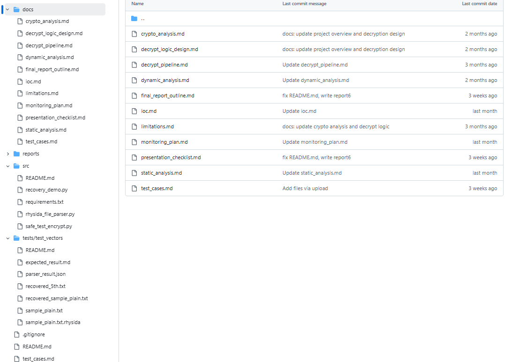

*그림 1. 최종 저장소 구조. 분석 문서와 실행 코드 및 테스트 자료가 역할별로 분리되어 있다.*

## 1.5 회차별 진행 과정

| 회차 | 주요 수행 내용 | 다음 단계로 전달된 산출물 |
|---|---|---|
| 1회차 | 프로젝트 목표·역할·WBS 수립, GitHub 협업 구조 구성, Rhysida 공개 정보 조사 | 역할 분담표, 조사 범위, 저장소 기본 구조 |
| 2회차 | 암호화 알고리즘 역할 조사, PE 구조·문자열·IAT 중심 정적 분석, 격리 동적 분석 환경 구상 | 암호화 입력값 목록, 파일 처리 API 후보, VM 관찰 계획 |
| 3회차 | 파일 본문 암호화와 난수 생성 역할 구분, 디렉터리 필터·분기·오프셋 흐름 심화, `WriteFile` 중심 관찰 지점 설계 | AES 키·IV·오프셋을 파서와 복호화기에 전달하기 위한 요구사항 |
| 4회차 | 안전한 더미 파일 형식과 테스트 푸터 정의, 파서·복구 데모 기본 구현, 시간·메모리 관찰 절차 구체화 | 암호문/메타데이터 분리 규칙, SHA-256 검증 항목 |
| 5회차 | 암호화기·파서·복구 도구를 하나의 실행 흐름으로 연결하고 정상 복구 검증 | 실행 가능한 통합 파이프라인과 `verified` 판정 |
| 6회차 | 정상 1건과 실패 5건 테스트, 한계점 정리, 발표·최종 산출물 통합 | 성공·실패 증적, 재현 명령, 최종보고서 근거 |

회차별 작업은 단순 병렬 조사로 끝나지 않았다. 이지원의 정적 분석 결과는 파일 경계와 API 관찰 지점을 제공했고, 최지우의 동적 분석 설계는 그 지점에서 키·IV 및 오프셋 후보를 확인하는 절차로 이어졌다. 최민혁은 이를 복호화 조건과 전체 흐름으로 정리했으며, 안시후는 조건을 안전하게 주입할 수 있는 암호화기·파서·복구 데모를 구현하였다.

---

# 2. 기술적 상세 분석

## 2.1 전체 암호화 모델

저장소에 정리된 Rhysida 분석 결과에서 암호화 요소의 역할은 다음과 같이 구분된다.

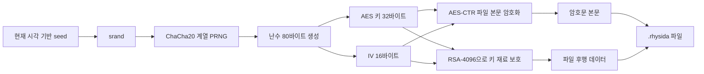

핵심은 **ChaCha20과 AES-CTR의 역할이 다르다**는 점이다. 이 분석 모델에서 ChaCha20 계열 구성요소는 파일 본문을 직접 암호화하는 알고리즘이 아니라 AES 키와 IV 생성에 쓰이는 PRNG 역할을 한다. 파일 본문은 AES-CTR로 처리되고, 키 재료는 RSA-4096으로 보호되어 파일 후단에 저장되는 구조로 정리하였다.

| 구성요소 | 역할 | 복호화 관점의 의미 |
|---|---|---|
| `srand(time(NULL))` | 시간값을 난수 생성 초기 상태에 반영 | 시각 범위를 알면 후보 seed 탐색 가능성을 검토할 수 있으나 변종·구현 검증이 필요함 |
| ChaCha20 계열 PRNG | AES 키와 IV로 사용할 난수 생성 | PRNG 상태 또는 입력을 재현해야 동일 키 재생성 가능 |
| AES-CTR | 파일 본문을 대칭키 방식으로 암호화 | 같은 키와 IV로 다시 처리하면 복호화 가능 |
| RSA-4096 | AES 키·IV 등 복구에 필요한 재료 보호 | 공격자 개인키가 없으면 보호된 키 재료를 직접 해제하기 어려움 |
| 파일 후행 데이터 | 보호된 키 재료 또는 메타데이터 저장 영역 | 본문과 후행 데이터의 정확한 경계 파악이 필요함 |

AES-CTR은 CTR 모드의 특성상 암호화와 복호화가 같은 키스트림 XOR 연산을 사용한다. 같은 키와 IV를 사용하면 다음 관계가 성립한다.

```text
암호문 C = 평문 P XOR KeyStream(K, IV)
복구문 P = 암호문 C XOR KeyStream(K, IV)
```

따라서 암호화 결과가 매번 달라지는 것은 정상이다. 키와 IV가 매 실행마다 새로 생성되기 때문이다. 그러나 해당 실행에 사용된 정확한 키와 IV를 확보할 수 있다면 그 암호문은 복호화할 수 있다. 반대로 알고리즘을 알아도 키·IV를 모르면 실제 피해 파일을 복원할 수 없다. CTR 모드의 구조는 [NIST SP 800-38A](https://csrc.nist.gov/pubs/sp/800/38/a/final)를 기준으로 설명하였다.

## 2.2 복호화 가능 조건

복호화 파이프라인이 동작하려면 최소한 다음 정보가 필요하다.

1. **암호문 본문의 정확한 범위**: 후행 데이터가 붙은 경우 본문과 푸터를 분리해야 한다.
2. **대칭키**: 본 프로젝트 구현에서는 32바이트 AES-256 키를 사용한다.
3. **IV 또는 카운터 초기값**: 본 프로젝트 구현에서는 16바이트 IV를 사용한다.
4. **암호화된 오프셋과 길이**: 파일 전체인지 일부 구간인지 알아야 한다.
5. **원본 검증 기준**: 원본 SHA-256, 알려진 파일 헤더, 파일 형식 파서 등의 확인값이 필요하다.

이 조건은 프로젝트의 역할 연결 기준이기도 하다. 정적 분석은 1번과 4번의 코드 근거를 찾고, 동적 분석은 실행 중 2번과 3번의 값을 관찰하며, 파서는 1번의 경계를 구현하고, 복구 도구는 2~4번을 이용해 복호화한 뒤 5번으로 결과를 판정한다.

## 2.3 정적 분석

정적 분석은 프로그램을 실행하지 않고 실행 파일의 구조, 문자열, import 함수, 디스어셈블리 제어 흐름을 조사하는 과정이다. 본 프로젝트에서는 저장소에 정리된 분석 자료를 기준으로 다음 항목을 확인하였다.

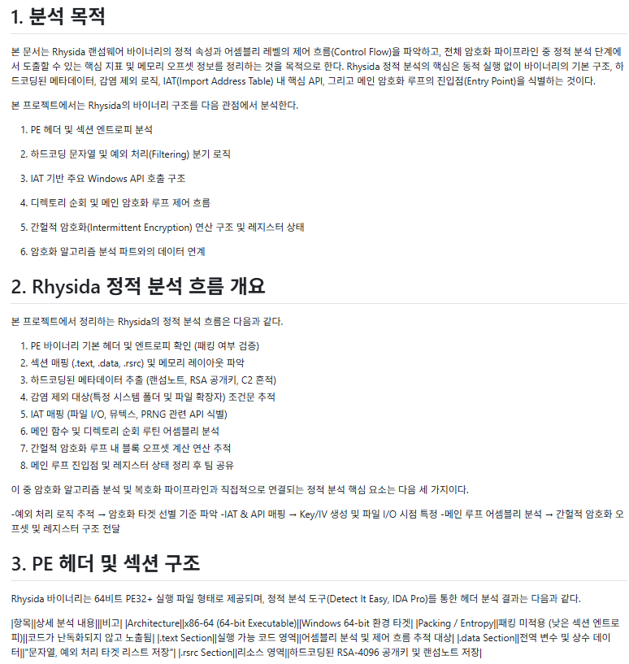

*그림 2. PE 구조, 문자열, IAT와 암호화 루틴을 연결한 정적 분석 요약*

### 2.3.1 PE 구조와 패킹 징후

- 분석 대상은 Windows x86-64 계열 PE32+ 구조로 정리되었다.
- `.text`, `.data`, `.rsrc` 등의 섹션을 확인하여 실행 코드, 전역 데이터, 리소스의 위치를 구분하였다.
- 섹션 엔트로피와 크기 불균형은 패킹 또는 난독화 가능성을 판단하는 참고 지표로 사용하였다.
- 엔트로피가 높다는 사실만으로 악성이나 패킹을 단정하지 않고, import 수, 진입점 코드, 문자열 가시성과 함께 해석하였다.

### 2.3.2 문자열과 제외 규칙

저장소 문서에는 Windows, Program Files, ProgramData 등의 경로와 `.exe`, `.dll`, `.sys`, `.iso` 등의 확장자 제외 규칙이 정리되어 있다. 이는 랜섬웨어가 운영체제 동작을 즉시 파괴하거나 실행 파일까지 무차별 처리하는 것을 피하면서 사용자 데이터 중심으로 대상을 선택하는 흐름을 추정하는 근거가 된다.

### 2.3.3 IAT와 Windows API

| API | 일반적 기능 | 프로젝트에서의 해석과 활용 |
|---|---|---|
| `CreateMutexW` | 이름 있는 뮤텍스를 생성하거나 연다 | 중복 실행 방지 여부를 확인하는 관찰 지점 |
| `FindFirstFileW` / `FindNextFileW` | 디렉터리의 파일을 순회한다 | 대상 파일 탐색 루프의 시작과 반복을 찾는 근거 |
| `CreateFileW` | 파일 또는 장치를 연다 | 암호화 대상 파일 핸들을 획득하는 지점 |
| `ReadFile` | 파일 데이터를 버퍼로 읽는다 | 암호화 전 평문 버퍼 후보를 찾는 지점 |
| `WriteFile` | 버퍼의 데이터를 파일에 쓴다 | 암호화된 버퍼와 기록 길이를 확인하는 핵심 중단점 |
| `SetFilePointerEx` | 64비트 파일 포인터를 원하는 오프셋으로 이동한다 | 간헐적 암호화에서 처리 구간이 건너뛰어지는 패턴을 확인하는 지점 |
| `CryptGenRandom` / `SystemFunction036` | 암호학적 난수를 생성한다 | 키·IV 생성 또는 난수 초기화 관련 후보 지점 |

Windows 파일 API의 기능은 Microsoft의 [File Management Functions](https://learn.microsoft.com/en-us/windows/win32/fileio/file-management-functions) 및 [`SetFilePointerEx` 문서](https://learn.microsoft.com/en-us/windows/win32/api/fileapi/nf-fileapi-setfilepointerex)를 참고하였다.

### 2.3.4 제어 흐름과 간헐적 암호화

정적 분석에서는 디렉터리 순회 → 경로·확장자 비교 → 파일 열기 → 크기·오프셋 계산 → 읽기 → 암호화 → 쓰기의 흐름을 연결하였다. x64 Windows 호출 규약에서 함수 인수가 주로 RCX, RDX, R8, R9 레지스터를 통해 전달된다는 점과 `je`, `jne` 등 조건 분기를 이용해 필터링 조건을 추적하였다.

특히 `SetFilePointerEx`가 반복적으로 호출되고 파일 크기에 따라 오프셋이 계산되는 흐름은 전체 파일을 연속 암호화하지 않고 일부 구간을 건너뛰며 처리하는 **간헐적 암호화** 가능성을 분석하는 근거가 되었다. 이 정보는 복호화기에도 동일한 구간 계산이 필요하다는 요구사항으로 전달된다.

## 2.4 동적 분석 설계

동적 분석은 프로그램을 실행하면서 실제 API 호출, 레지스터, 메모리, 파일, 프로세스, 네트워크 변화를 관찰하는 과정이다. 랜섬웨어는 위험도가 높으므로 Host-Only 네트워크, 스냅샷, 공유 폴더·클립보드 차단, NTP 비활성화가 적용된 격리 VM을 전제로 절차를 설계하였다.

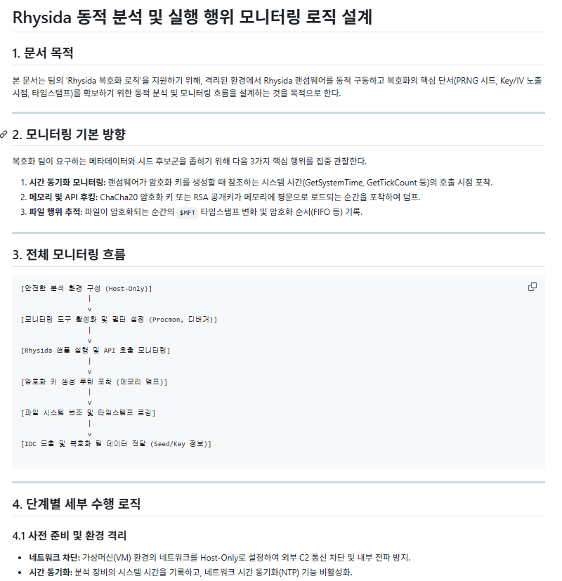

*그림 3. 정적 분석에서 찾은 API를 동적 분석 중단점과 관찰 항목으로 전환한 과정*

| 도구 | 관찰 대상 | 기대 결과 |
|---|---|---|
| x64dbg | 시간 함수, 난수 함수, `CreateFileW`, `ReadFile`, `WriteFile`, `SetFilePointerEx` 중단점 | 키·IV 후보, 입력·출력 버퍼, 파일 오프셋과 길이 확인 |
| Procmon | 파일 생성·열기·쓰기·이름 변경, 프로세스 및 레지스트리 이벤트 | `.rhysida` 확장자 변경과 파일 처리 순서 확인 |
| Wireshark | DNS, TCP, HTTP 등 네트워크 시도 | 외부 통신 여부 및 목적지 후보 확인 |
| VM 스냅샷 비교 | 실행 전후 파일과 시스템 상태 | 생성·변경·삭제된 산출물 확인 및 환경 복구 |

정적 분석에서 `WriteFile` 호출 위치를 알아냈다면 동적 분석에서는 그 호출 직전에 중단하여 RDX가 가리키는 버퍼와 기록 길이를 확인할 수 있다. `ReadFile` 직후 버퍼와 비교하면 암호화 전후 데이터 변화를 확인할 수 있으며, `SetFilePointerEx`의 이동 거리와 반복 횟수는 간헐적 암호화 구간 복원에 활용할 수 있다. 시간·난수 관련 함수 전후의 레지스터와 메모리는 seed, 키, IV 후보를 수집하는 지점이다.

> 동적 분석의 증거 수준: 본 프로젝트는 안전한 관찰 절차와 중단점을 구체화했지만, 최종 저장소에는 실제 악성 샘플 실행 로그나 키가 포함된 메모리 덤프를 수록하지 않았다. 따라서 이 절은 **수행 가능한 분석 설계와 예상 관찰값**이며, 실제 키 획득 성과로 해석해서는 안 된다.

## 2.5 IOC 정리

IOC(Indicator of Compromise)는 침해 여부를 탐지하거나 조사할 때 참고하는 파일·프로세스·네트워크 흔적이다. 본 프로젝트에서는 확실하게 기록된 항목과 추가 확보가 필요한 항목을 구분하였다.

| 분류 | 항목 | 상태 및 해석 |
|---|---|---|
| 파일 | `.rhysida` 확장자 | 계열 식별에 활용할 수 있으나 단독으로 악성 여부를 확정할 수 없음 |
| 파일 | Rhysida 랜섬노트 이름 계열 | 공개 보고서와 대조가 필요한 탐지 후보 |
| 실행 파일 | Windows x86-64 PE 구조 | 분석 대상 유형을 나타내며 고유 IOC는 아님 |
| 행위 | 파일 순회·읽기·쓰기·이름 변경 API 연속 호출 | 행위 기반 탐지 규칙의 근거 |
| 행위 | 특정 시스템 경로와 실행 파일 확장자 제외 | 정적 분석 문서에 기반한 필터링 특징 |
| 미확보 | 분석 샘플의 MD5/SHA-256 | 최종 저장소에 원본 샘플이 없어 확정하지 않음 |
| 미확보 | 고유 mutex 문자열, onion 주소, 연락처, 네트워크 주소 | 실제 샘플별 검증이 필요함 |
| 미확정 | 실제 푸터의 보편적 크기와 모든 변종 형식 | 단일 규칙으로 구현하지 않음 |

프로젝트의 YARA 관련 내용은 분석 특징을 표현한 예시 수준이며, 다수 정상·악성 샘플로 오탐과 미탐을 검증한 운영용 탐지 규칙은 아니다. 공개 IOC는 CISA의 [StopRansomware: Rhysida Ransomware](https://www.cisa.gov/news-events/cybersecurity-advisories/aa23-319a)와 같은 최신 권고문과 함께 교차 검증해야 한다.

## 2.6 복호화 로직 설계와 구현 범위

초기 설계에서는 시간 기반 seed 후보 생성, PRNG 상태 재현, 키·IV 후보 생성, AES-CTR 복호화, 해시 검증으로 구성된 자동 복구 흐름을 검토하였다. 그러나 실제 구현에서는 검증되지 않은 seed 재현을 성공한 것처럼 포함하지 않고, 키·IV가 확보된 이후의 파이프라인을 안전하게 재현하였다.

| 구분 | 초기 설계 | 최종 구현 |
|---|---|---|
| 키 획득 | 시간 범위에서 seed 후보를 생성하고 PRNG를 재현 | 테스트 암호화기가 생성한 키·IV를 메타데이터에 저장 |
| 파일 형식 | 실제 변종의 후행 데이터 구조를 분석해 경계 추정 | 고정 magic과 JSON 길이를 가진 프로젝트 전용 테스트 푸터 |
| 복호화 | 후보별 AES-CTR 복호화와 성공 판정 | 확보된 32바이트 키와 16바이트 IV로 AES-CTR 복호화 |
| 검증 | 파일 헤더·해시 등 복수 기준 검토 | 원본 SHA-256과 복구본 SHA-256 비교, `verified` 출력 |
| 안전 범위 | 실제 피해 파일 대응 가능성 검토 | 단일 더미 파일만 처리, 감염·삭제·전파 기능 없음 |

## 2.7 프로젝트 전용 테스트 파일 형식

안전한 재현을 위해 실제 Rhysida 푸터라고 주장하지 않는 별도 형식을 정의하였다.

```text
[AES-CTR 암호문]
[Magic: ASC_RHYSIDA_TEST_FOOTER_V1\n]
[JSON 길이: 8바이트 big-endian]
[UTF-8 JSON 메타데이터]
```

JSON에는 다음 필드가 포함된다.

| 필드 | 의미 |
|---|---|
| `format` | 프로젝트 테스트 형식 식별자 |
| `aes_key` | 32바이트 AES 키의 16진수 표현 |
| `aes_iv` | 16바이트 IV의 16진수 표현 |
| `original_name` | 원본 파일명 |
| `plaintext_size` | 원본 크기 |
| `plaintext_sha256` | 복구 성공 판정에 사용하는 원본 SHA-256 |
| `ciphertext_sha256` | 파서가 본문을 정확히 분리했는지 확인하는 암호문 SHA-256 |
| `note` | 실제 Rhysida 형식이 아닌 안전한 테스트 형식이라는 설명 |

파서는 파일 끝에서 magic을 탐색하고, 8바이트 길이값만큼 JSON을 읽는다. magic 앞부분은 암호문 본문으로 분리하고 SHA-256을 다시 계산한다.

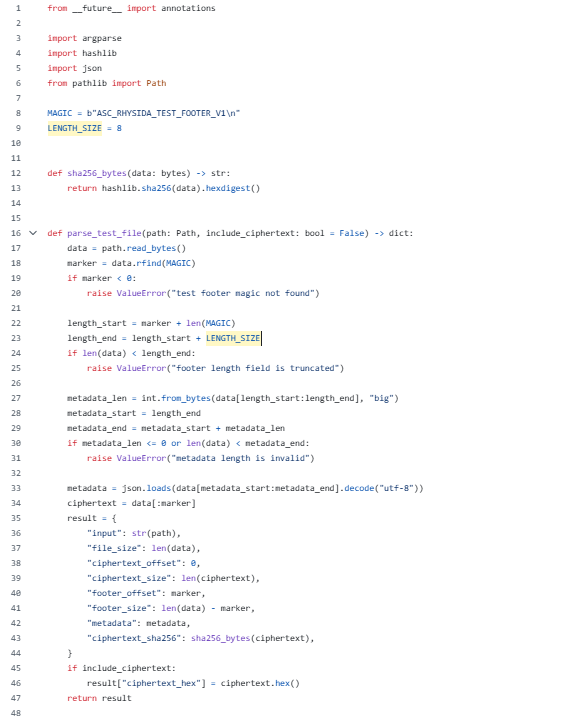

*그림 4. magic 탐색, JSON 길이 검증, 암호문 분리를 수행하는 파서 핵심 코드*

복구 도구는 메타데이터 또는 별도 파서 JSON에서 키·IV를 읽고 길이를 검증한 뒤 AES-CTR 복호화를 수행한다. 출력 파일의 SHA-256이 기대값과 같은지 비교해 `verified: true/false`를 출력한다.

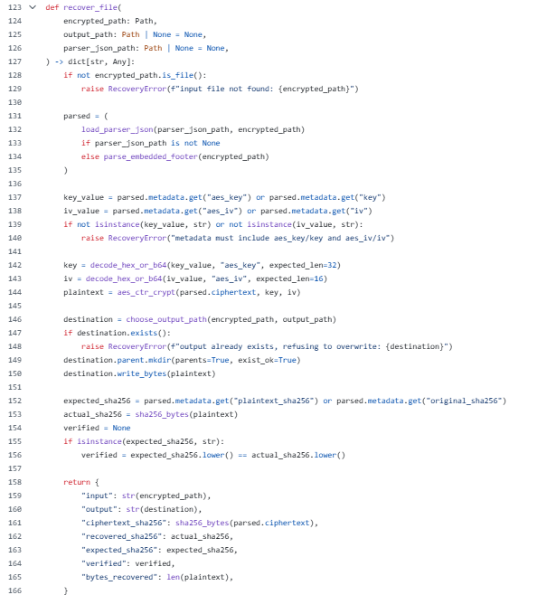

*그림 5. 키·IV 검증, AES-CTR 복호화, SHA-256 성공 판정을 수행하는 복구 코드*

PyCA `cryptography`의 AES 및 CTR 사용법은 [공식 symmetric encryption 문서](https://cryptography.io/en/latest/hazmat/primitives/symmetric-encryption/)를 참고하였다.

## 2.8 안전성 설계

프로젝트 코드는 다음 제한을 의도적으로 둔다.

- 사용자가 명시한 단일 파일만 입력으로 받는다.
- 디렉터리를 재귀 순회하지 않는다.
- 원본 파일을 삭제하거나 이름을 바꾸지 않는다.
- 시스템 파일, 백업, 복구 지점을 변경하지 않는다.
- 네트워크 통신, 자기 복제, 지속성 확보 기능을 포함하지 않는다.
- 복구 도구는 기존 출력 파일을 발견하면 덮어쓰지 않고 즉시 중단한다.
- 테스트 푸터에는 실제 악성 형식이 아니라는 설명을 포함한다.

이 제한은 랜섬웨어의 암호화·복호화 원리를 재현하면서도 악성 행위를 구현하지 않기 위한 프로젝트의 핵심 기준이다.

---

# 3. 최종 결과물

## 3.1 산출물 구성

| 산출물 | 기능 | 최종 상태 |
|---|---|---|
| `src/safe_test_encrypt.py` | 단일 더미 파일을 AES-CTR로 암호화하고 테스트 푸터 추가 | 구현 및 실행 확인 |
| `src/rhysida_file_parser.py` | 암호문과 테스트 푸터 분리, 메타데이터·SHA-256 출력 | 구현 및 실행 확인 |
| `src/recovery_demo.py` | 키·IV 검증, AES-CTR 복호화, SHA-256 성공 판정 | 구현 및 실행 확인 |
| `src/requirements.txt` | Python 의존성 `cryptography` 명시 | 작성 완료 |
| `tests/test_vectors/` | 정상 입력, 암호화 파일, 복구본, 파서 결과 등 테스트 벡터 | 구성 완료 |
| `test_cases.md` | 입력 누락, 출력 충돌, 푸터 손상, 잘못된 키 등 실패 사례 | 검증 완료 |
| `docs/` | 암호화·복호화·정적·동적·IOC·파이프라인 분석 문서 | 통합 완료 |
| `reports/` | 회차별 진행 기록과 최종 정리 자료 | 작성 완료 |

전체 코드는 [프로젝트 GitHub 저장소](https://github.com/choi95411/26-1-ASC-Project)에서 확인할 수 있다.

## 3.2 최종 실행 흐름

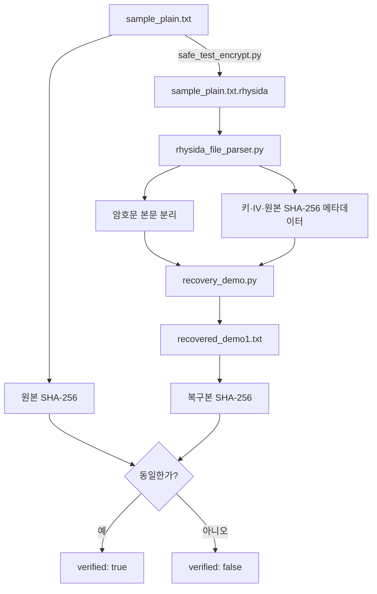

### 3.2.1 테스트 파일 암호화

```bash
python3 src/safe_test_encrypt.py \
  tests/test_vectors/sample_plain.txt \
  -o tests/test_vectors/sample_plain.txt.rhysida \
  --force
```

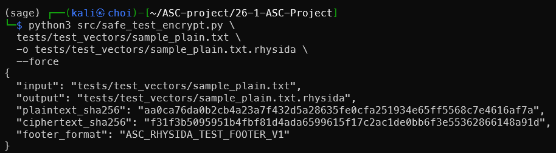

*그림 6. 단일 더미 파일 암호화와 원본·암호문 SHA-256 출력*

AES 키와 IV는 매번 `os.urandom`으로 새로 생성되므로 같은 평문을 다시 암호화해도 암호문 SHA-256은 달라질 수 있다. 이번 검증에서 생성된 암호문 SHA-256은 `f31f3b5095951b4fbf81d4ada6599615f17c2ac1de0bb6f3e55362866148a91d`이었다.

### 3.2.2 파일 파싱

```bash
python3 src/rhysida_file_parser.py \
  tests/test_vectors/sample_plain.txt.rhysida \
  -o tests/test_vectors/parser_output.json
```

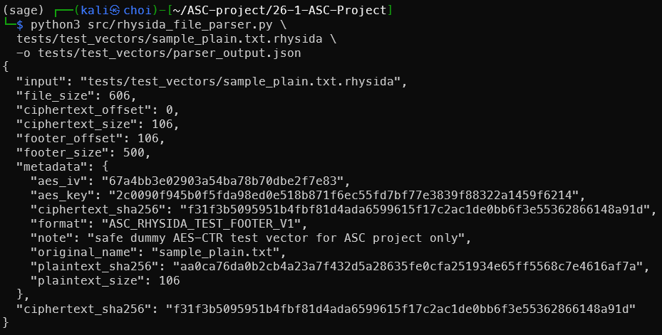

*그림 7. 암호문 길이, 키·IV, 원본 SHA-256과 암호문 SHA-256을 분리한 결과*

### 3.2.3 복호화와 자체 검증

```bash
python3 src/recovery_demo.py \
  tests/test_vectors/sample_plain.txt.rhysida \
  -o tests/test_vectors/recovered_demo1.txt \
  --json
```

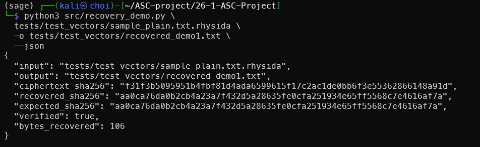

*그림 8. 복구본 생성, SHA-256 비교, `verified: true`가 출력된 정상 실행 결과*

### 3.2.4 독립적인 SHA-256 및 바이트 비교

도구 자체 출력만 신뢰하지 않고 운영체제 명령으로 원본과 복구본을 다시 비교하였다.

```bash
sha256sum \
  tests/test_vectors/sample_plain.txt \
  tests/test_vectors/recovered_demo1.txt

cmp tests/test_vectors/sample_plain.txt \
    tests/test_vectors/recovered_demo1.txt
```

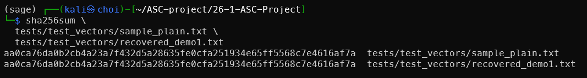

*그림 9. 두 파일의 SHA-256이 일치한 결과*

원본과 복구본의 SHA-256은 모두 다음과 같다.

```text
aa0ca76da0b2cb4a23a7f432d5a28635fe0cfa251934e65ff5568c7e4616af7a
```

`cmp`는 두 파일이 동일할 때 별도 차이 출력을 내지 않고 종료 코드 0을 반환한다. 따라서 본 테스트에서 파일 크기 106바이트와 전체 바이트 내용이 동일하게 복구되었다.

## 3.3 결과 판정 기준

복구 프로그램이 출력 파일을 생성했다는 사실만으로는 성공이라 할 수 없다. 특히 AES-CTR은 잘못된 키를 사용해도 패딩 오류 없이 임의의 바이트를 출력할 수 있다. 최종 도구는 다음 조건을 조합하여 성공을 판정한다.

1. 입력 파일과 테스트 푸터가 정상적으로 파싱된다.
2. AES 키가 32바이트, IV가 16바이트인지 확인한다.
3. 복호화 과정이 정상 종료된다.
4. 복구 파일 크기가 기대값과 일치한다.
5. 복구 파일 SHA-256이 푸터에 기록된 원본 SHA-256과 일치한다.
6. 최종적으로 `verified: true`가 출력된다.

---

# 4. 실전 입증 및 성과

## 4.1 테스트 개요

이 프로젝트는 취약점 공격 성능이나 실제 피해 복구율을 겨루는 프로젝트가 아니므로 처리 속도, CVE, 버그바운티와 같은 지표를 임의로 제시하지 않았다. 대신 정상 흐름과 실패 흐름을 재현하고 프로그램이 각각 올바르게 판정하는지를 기능 지표로 사용하였다.

| 지표 | 결과 |
|---|---|
| 정상 복구 테스트 | 1건 성공 |
| 실패 조건 테스트 | 5건 수행 |
| 원본/복구본 파일 크기 | 106바이트 / 106바이트 |
| SHA-256 비교 | 일치 |
| 바이트 단위 비교 | 일치 |
| 정상 복구 판정 | `verified: true` |
| 실제 악성 샘플 실행 | 수행하지 않음 |
| 실제 피해 파일 자동 키 복원 | 구현하지 않음 |

## 4.2 정상 및 실패 사례

| 번호 | 시험 조건 | 기대 동작 | 실제 결과 |
|---|---|---|---|
| 1 | 정상 테스트 파일, 정상 키·IV | 복구 후 SHA-256 일치 | `verified: true`, 종료 코드 0 |
| 2 | 존재하지 않는 입력 파일 | 명시적 오류와 비정상 종료 | 오류 출력, 종료 코드 1 |
| 3 | 지정한 출력 파일이 이미 존재함 | 덮어쓰기 거부 | 오류 출력, 종료 코드 1 |
| 4 | 테스트 푸터 magic 손상 | 파싱 거부 | 오류 출력, 종료 코드 1 |
| 5 | 길이는 같지만 값이 다른 키 | 출력은 생성될 수 있으나 검증 실패 | `verified: false`, 종료 코드 0 |
| 6 | 3바이트의 비정상 키 | 키 길이 검증에서 거부 | 오류 출력, 종료 코드 1 |

## 4.3 테스트 결과 해석

가장 중요한 실패 사례는 **잘못된 32바이트 키**이다. 키 길이는 정상이라 AES-CTR 연산 자체는 실행되고 출력 파일도 생성된다. 그러나 내용은 원본이 아니며 SHA-256 비교에서 `verified: false`가 된다. 이는 다음 사실을 보여준다.

- “프로그램이 오류 없이 끝남”과 “파일이 올바르게 복구됨”은 다르다.
- AES-CTR은 잘못된 키에 대해 자동으로 무결성 오류를 제공하지 않는다.
- 실제 복구 도구에는 신뢰할 수 있는 원본 해시, 파일 구조 검증 또는 알려진 헤더 등 별도의 검증 기준이 필수이다.

테스트 푸터 magic 손상과 짧은 키 입력은 복호화 전에 차단되었다. 출력 파일 충돌도 기본적으로 거부하여 기존 파일 손상을 방지하였다. 이 결과는 파이프라인이 정상 경로뿐 아니라 입력 검증과 안전한 실패 처리를 포함하고 있음을 보여준다.

## 4.4 프로젝트 성과

1. 암호화 알고리즘의 명칭 나열을 넘어 PRNG, 대칭키 암호, 공개키 암호의 역할을 분리하였다.
2. 정적 분석 결과를 동적 분석 중단점과 파서 요구사항으로 연결하였다.
3. 분석 문서만으로 끝내지 않고 안전한 암호화·파싱·복구 코드를 실제로 실행하였다.
4. `verified`와 독립적인 `sha256sum`, `cmp` 검증으로 복구 결과를 입증하였다.
5. 실제 피해 복구와 교육용 재현의 차이를 명시하여 결과의 적용 범위를 분명히 하였다.
6. 실패 사례를 포함해 다음 작업자가 재현하고 확장할 수 있는 형태로 저장소를 구성하였다.

---

# 5. 팀원별 기여 상세

## 5.1 역할 분담과 산출물 전달

| 팀원 | 담당 영역 | 핵심 산출물 | 다음 역할에 전달한 내용 |
|---|---|---|---|
| 최민혁 | 프로젝트 총괄 및 암호화·복호화 구조 | WBS, 알고리즘 역할 구분, 복호화 조건, 통합 흐름, 보고서 | 각 분석 결과를 키·IV·경계·오프셋·검증 요구사항으로 통합 |
| 이지원 | 정적 분석 | PE·문자열·IAT·제어 흐름, 필터링, 간헐적 암호화 분석 | 동적 분석 중단점과 처리할 파일 구조 후보 제공 |
| 최지우 | 동적 분석 설계 | 격리 환경, x64dbg·Procmon·Wireshark 관찰 절차 | 실행 시 키·IV·파일 오프셋·확장자 변경을 확인할 방법 제공 |
| 안시후 | 파이프라인 구현 및 테스트 | 안전한 암호화기, 파서, 복구 데모, 정상·실패 테스트 | 분석 요구사항을 실행 가능한 코드와 증적 파일로 변환 |


## 5.2 최민혁

- 프로젝트 목표, WBS와 회차별 우선순위를 조정하였다.
- ChaCha20 계열 구성요소가 파일 본문 암호화가 아니라 키 재료 생성에 사용되고, AES-CTR이 본문을 처리한다는 역할 구분을 정리하였다.
- RSA로 보호된 키 재료, 파일 후행 데이터, 오프셋, 키·IV, 성공 검증값을 복호화의 필수 조건으로 정의하였다.
- 정적·동적 분석 결과가 구현 코드로 이어지도록 파서와 복구 흐름을 통합하였다.
- 회차별 보고서, 발표 자료, 최종 기술 보고서를 정리하고 프로젝트 범위와 한계를 명시하였다.

## 5.3 이지원

- PE32+ 실행 파일의 섹션, 문자열, import 함수를 중심으로 항목을 정리하였다.
- `FindFirstFileW`, `FindNextFileW`, `CreateFileW`, `ReadFile`, `WriteFile`, `SetFilePointerEx`를 파일 탐색·처리 순서와 연결하였다.
- 경로와 확장자 제외 규칙, 조건 분기, 레지스터 인자 흐름을 통해 대상 선택 과정을 분석하였다.
- 파일 크기와 오프셋 이동 흐름을 바탕으로 간헐적 암호화 가능성과 복호화 시 동일 구간 계산의 필요성을 제시하였다.
- 정적 분석에서 확인한 API 위치를 동적 분석 중단점 후보로 전달하였다.

## 5.4 안시후

- 실제 악성 행위 없이 단일 더미 파일만 처리하는 `safe_test_encrypt.py`를 구현하였다.
- 프로젝트 전용 magic, 길이 필드, JSON 메타데이터로 구성된 테스트 푸터를 정의하였다.
- `rhysida_file_parser.py`에서 암호문과 후행 메타데이터를 분리하고 해시를 계산하도록 구현하였다.
- `recovery_demo.py`에서 키·IV 길이 검사, AES-CTR 복호화, 출력 보호, SHA-256 검증을 구현하였다.
- 정상 테스트와 입력 누락, 출력 충돌, 푸터 손상, 잘못된 키, 비정상 키 길이 등의 실패 테스트를 구성하였다.

## 5.5 최지우

- Host-Only 네트워크와 VM 스냅샷을 이용한 격리 동적 분석 환경을 설계하였다.
- 시간·난수 함수와 파일 API를 대상으로 x64dbg 중단점과 레지스터·메모리 관찰 항목을 정리하였다.
- Procmon을 이용한 파일 생성·쓰기·이름 변경·프로세스 행위 관찰 절차를 구성하였다.
- Wireshark를 이용한 네트워크 연결 시도 관찰 항목을 정리하였다.
- 키·IV 후보, 버퍼, 오프셋, 확장자 변경 등 정적 분석만으로 확정하기 어려운 값을 실행 중 검증하는 연결 지점을 제시하였다.

## 5.6 협업 방식

팀은 GitHub의 역할별 브랜치와 회차별 문서를 이용해 산출물을 공유하였다. 기여율은 단순 커밋 수로 계산하지 않고 WBS상 역할과 최종 산출물의 연결 관계를 기준으로 각 25%로 정리하였다. 커밋 기록은 [GitHub 커밋 내역](https://github.com/choi95411/26-1-ASC-Project/commits/main/)에서 확인할 수 있다.

---

# 6. 고찰 및 결론

## 6.1 트러블슈팅과 범위 조정

프로젝트 초기에는 공개 기관에서 제공하는 피해 복구 도구와 유사하게 실제 Rhysida 파일의 키를 자동 복원하는 수준을 목표로 검토하였다. 그러나 다음 문제가 있었다.

1. 실제 복구 도구의 내부 구현과 검증용 피해 데이터가 공개되어 있지 않았다.
2. 실제 샘플의 seed·PRNG 동작과 파일 후행 구조를 변종별로 확정할 근거가 부족했다.
3. RSA로 보호된 키 재료는 개인키 없이 일반적으로 직접 해제할 수 없다.
4. 랜섬웨어 샘플의 취급과 실행은 교육 프로젝트 환경에서 안전·윤리·법적 위험이 크다.
5. 검증되지 않은 키 복원 로직을 포함하면 실제 복구 가능성을 과장할 수 있었다.

이에 목표를 “실제 복구 도구의 완전 재현”에서 “분석 결과가 복호화 코드로 전달되는 안전한 파이프라인 재현”으로 조정하였다. 이 결정으로 실제 피해 복구라는 표현은 제한되었지만, 입력값·파일 경계·복호화·성공 검증을 실제 코드로 연결하고 누구나 재현할 수 있는 결과를 확보하였다.

## 6.2 한계점

### 6.2.1 실제 키 복원 미구현

최종 파이프라인은 키와 IV가 확보된 이후를 구현한다. 시간 기반 seed 탐색이나 PRNG 재현은 설계 검토 대상이지만, 실제 Rhysida 변종에서 검증된 자동 키 복원 기능은 아니다.

### 6.2.2 실제 푸터와 테스트 푸터의 차이

현재 magic과 JSON 메타데이터는 프로젝트용 형식이다. 실제 피해 파일의 RSA 보호 데이터, 버전별 푸터 크기, 구간 메타데이터와 동일하지 않다.

### 6.2.3 동적 분석 실증 자료 부족

격리 환경과 상세 중단점은 설계했지만 실제 악성 샘플의 Procmon 로그, 패킷 캡처, 메모리 덤프와 키 추출 화면을 최종 저장소에 포함하지 않았다. 따라서 동적 분석 절은 실증 완료가 아니라 후속 분석 절차이다.

### 6.2.4 변종 일반화 제한

랜섬웨어는 버전마다 암호화 알고리즘, 푸터, 제외 경로, 간헐적 암호화 구간이 달라질 수 있다. 현재 문서의 특징을 모든 Rhysida 샘플에 일괄 적용할 수 없다.

### 6.2.5 무결성 검증 방식

AES-CTR 자체는 인증 기능이 없다. 프로젝트에서는 미리 저장된 원본 SHA-256으로 결과를 확인하지만, 실제 피해 상황에서는 신뢰할 원본 해시가 없을 수 있다. 파일 형식 구조, magic bytes, 압축·문서 파서 등의 추가 검증이 필요하다.

## 6.3 향후 계획

1. 합법적으로 확보된 검증용 샘플과 공개 연구 데이터에서 샘플 해시, 파일 구조, 푸터 크기를 변종별로 대조한다.
2. 격리 VM에서 정적 분석으로 찾은 API에 중단점을 설정하고 실제 오프셋, 버퍼 변화, 키·IV 후보를 기록한다.
3. 시간 범위와 PRNG 초기 상태를 입력받는 독립 모듈을 작성하되, 검증된 샘플에서만 재현 가능 여부를 판정한다.
4. 실제 형식과 프로젝트 테스트 형식을 구분하는 파서 인터페이스를 설계하고 변종별 파서 플러그인을 추가한다.
5. PDF, ZIP, JPEG 등 파일 형식별 구조 검증을 SHA-256 대체 또는 보조 기준으로 추가한다.
6. 정상·실패 테스트를 자동화하고 다양한 크기, 빈 파일, 대용량 파일, 일부 구간 암호화 테스트를 확장한다.
7. 탐지 규칙은 다수 정상·악성 표본으로 오탐과 미탐을 측정한 뒤 운영 적용 여부를 판단한다.

## 6.4 최종 결론

본 프로젝트는 Rhysida 랜섬웨어를 조사했다는 수준에서 멈추지 않고, 분석 결과가 어떤 입력값과 파일 경계로 정리되어 복호화 파이프라인에 전달되는지를 구현으로 확인하였다. 정적 분석은 파일 탐색·필터·오프셋·암호화 루틴을 구조화했고, 동적 분석 설계는 키·IV·버퍼를 관찰할 실행 지점을 제시하였다. 이 정보는 최종적으로 안전한 테스트 암호화기, 파서, 복구 도구의 요구사항이 되었다.

정상 테스트에서는 원본과 복구본의 SHA-256 및 전체 바이트가 일치했다. 실패 테스트에서는 잘못된 키로도 출력 파일이 생길 수 있지만 해시 검증에서 실패한다는 점을 확인하였다. 이를 통해 복호화 프로그램의 핵심은 단순한 AES 연산뿐 아니라 정확한 키 획득, 파일 구조 파싱, 처리 구간 복원, 신뢰 가능한 결과 검증이라는 결론을 얻었다.

실제 피해 복구 도구의 완전한 재현에는 이르지 못했으나, 범위를 투명하게 조정하고 분석·설계·구현·검증을 하나의 재현 가능한 흐름으로 완성했다는 점에서 교육 프로젝트의 목표를 달성하였다.

---

# 7. 참고 문헌 및 자료

1. 6조 프로젝트 저장소, [choi95411/26-1-ASC-Project](https://github.com/choi95411/26-1-ASC-Project)
2. CISA, FBI, MS-ISAC, *[StopRansomware: Rhysida Ransomware](https://www.cisa.gov/news-events/cybersecurity-advisories/aa23-319a)*
3. KISA 암호이용활성화, [랜섬웨어 복구 관련 자료](https://seed.kisa.or.kr/kisa/Board/166/detailView.do)
4. NIST, *[SP 800-38A: Recommendation for Block Cipher Modes of Operation](https://csrc.nist.gov/pubs/sp/800/38/a/final)*
5. Microsoft Learn, *[File Management Functions](https://learn.microsoft.com/en-us/windows/win32/fileio/file-management-functions)*
6. Microsoft Learn, *[SetFilePointerEx function](https://learn.microsoft.com/en-us/windows/win32/api/fileapi/nf-fileapi-setfilepointerex)*
7. PyCA cryptography, *[Symmetric encryption](https://cryptography.io/en/latest/hazmat/primitives/symmetric-encryption/)*
8. Python Software Foundation, *[hashlib — Secure hashes and message digests](https://docs.python.org/3/library/hashlib.html)*

---

## 부록 A. 전체 시연 명령

```bash
cd ~/ASC-project/26-1-ASC-Project
python3 -m pip install -r src/requirements.txt

python3 src/safe_test_encrypt.py \
  tests/test_vectors/sample_plain.txt \
  -o tests/test_vectors/sample_plain.txt.rhysida \
  --force

python3 src/rhysida_file_parser.py \
  tests/test_vectors/sample_plain.txt.rhysida \
  -o tests/test_vectors/parser_output.json

python3 src/recovery_demo.py \
  tests/test_vectors/sample_plain.txt.rhysida \
  -o tests/test_vectors/recovered_demo1.txt \
  --json

sha256sum \
  tests/test_vectors/sample_plain.txt \
  tests/test_vectors/recovered_demo1.txt

cmp tests/test_vectors/sample_plain.txt \
    tests/test_vectors/recovered_demo1.txt

echo $?
```

정상 결과에서는 복구 도구가 `verified: true`를 출력하고, 두 SHA-256이 같으며, `cmp` 후 `echo $?`가 `0`을 출력한다.

## 부록 B. 용어 정리

| 용어 | 설명 |
|---|---|
| AES | 같은 키로 암호화와 복호화를 수행하는 대칭키 블록 암호 |
| CTR | 블록 암호로 키스트림을 만들고 평문과 XOR하는 운용 모드 |
| RSA | 공개키와 개인키를 사용하는 비대칭 암호 방식 |
| PRNG | 초기값과 내부 상태로 의사난수를 생성하는 알고리즘 |
| IV | 같은 키에서도 서로 다른 키스트림을 만들기 위한 초기화 값 |
| PE | Windows 실행 파일의 구조 형식 |
| IAT | 실행 파일이 외부 DLL 함수 주소를 참조하는 테이블 |
| IOC | 침해 사고 탐지와 조사에 활용하는 파일·행위·네트워크 지표 |
| 엔트로피 | 데이터의 무작위성 정도를 나타내는 값으로 패킹·암호화 추정에 활용 |
| 푸터 | 파일 본문 뒤에 덧붙는 메타데이터 또는 키 관련 영역 |
| 오프셋 | 파일 시작점으로부터 특정 데이터 위치까지의 거리 |
| SHA-256 | 입력 데이터에서 256비트 해시값을 계산하는 함수 |
| `verified` | 복구본 해시와 기대 원본 해시가 일치하는지를 나타내는 프로젝트 판정값 |
