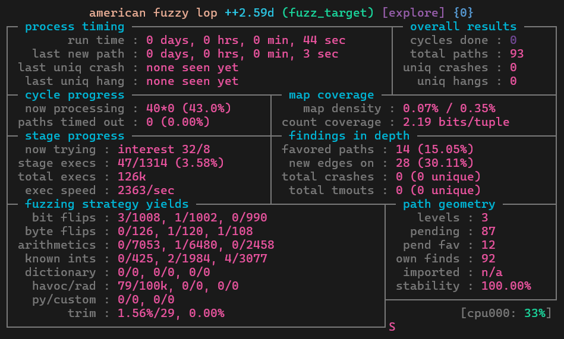

# ASC 프로젝트 최종 기술 보고서 — 프로젝트명

- **참여 인원:** (팀장) 20221809_이채은, (팀원) 20211677_김영현, 20253327_박성현, 20261616_김인환
- **프로젝트 구분:** 기초 프로젝트

## 1. 프로젝트 개요 및 목표

본 프로젝트는 오픈소스 퍼징 도구인 AFL++를 이용하여, 오픈소스 게임 엔진 Godot의 C++ 코드베이스에서 숨겨진 버그와 취약점을 탐색하는 것을 목표로 진행되었다. 특히 Godot의 스크립트 언어인 GDScript를 처리하는 파서 경로를 대상으로 삼아, 도구 설치부터 계측 빌드, 하네스 설계, 시드 준비, 퍼징 실행, 크래시 분류에 이르는 전체 파이프라인을 엔드투엔드로 구축하고 검증하였다.

프로젝트의 핵심 목표는 다음 네 가지로 정리된다.

1. Godot 엔진과 같이 실전 규모의 C++ 오픈소스 코드베이스에 AFL++ 계측 빌드를 적용하는 경험을 확보한다.
2. GDScript 파서(토크나이저 → 파서 → 분석기)를 대상으로 한 퍼징 하네스를 설계하고, 효율적인 탐색을 위한 시드 코퍼스와 딕셔너리를 준비한다.
3. `afl-fuzz`를 실행하여 커버리지 기반 탐색을 수행하고, 발견된 크래시를 자동으로 재현·분류하는 스크립트를 구현한다.
4. 시간적 제약을 고려하여, 이번 단계에서는 퍼징 결과 자체의 심층 분석보다 재현 가능한 퍼징 파이프라인을 구축하는 방법론 학습에 초점을 둔다.

## 2. 대상 선정 배경: 왜 Godot 엔진인가

Godot 엔진을 퍼징 대상으로 선정한 배경은 다음 세 가지 이유에 근거한다.

### 2.1 완전한 오픈소스 (MIT License)

Godot은 MIT 라이선스로 배포되는 완전한 오픈소스 프로젝트로, 소스코드에 자유롭게 접근하고 이를 직접 재빌드하여 계측할 수 있다는 실질적 장점이 있다.

### 2.2 실전 규모의 C++ 코드베이스

Godot은 C++로 작성된 대형 프로젝트로, 실제 프로덕션 수준의 소프트웨어에 퍼징을 적용해볼 수 있는 환경을 제공한다.

### 2.3 이미 검증된 버그 발견 사례

커뮤니티 차원에서도 성과가 이미 입증된 바 있다. qarmin이 개발한 오픈소스 퍼저 Qarminer는 Godot의 GDScript 실행 경로를 이용하여 Godot 본체 및 여러 모듈에서 200~300개 이상의 크래시 및 정의되지 않은 동작을 실제로 발견하였다. 이는 해당 대상에 실제로 발견 가능한 버그가 존재함이 이미 증명되었다는 것을 의미하며, 본 프로젝트의 타겟 선정에 신뢰도를 더한다.

## 3. 기술적 배경: 퍼징과 AFL++

### 3.1 퍼징(Fuzzing) 이란

퍼징의 핵심 아이디어는 단순하다. 프로그램에 무작위이거나 살짝 변형된 입력을 반복적으로 주입하면서, 프로그램이 비정상적으로 종료되거나(crash) 예상치 못하게 동작하는 순간을 자동으로 탐지하는 테스트 기법이다. 사람이 테스트 케이스를 일일이 작성하는 대신, 기계가 초당 수백에서 수천 회씩 입력을 변형해가며 프로그램을 검증한다는 점이 특징이다.

### 3.2 AFL++의 커버리지 기반 퍼징

AFL++는 여기서 한 단계 더 나아가 '커버리지 기반' 퍼징을 수행한다. 컴파일 시점에 프로그램 내부에 코드 커버리지를 측정하는 경량 계측 코드를 자동으로 삽입하고, 이전에 지나가지 않은 새로운 코드 경로를 통과한 입력을 우선적으로 변이 대상으로 선택한다. 이 과정은 다음과 같은 순환 구조로 반복된다.

- ① 시드 입력을 선택하여 변이(mutate)한다.
- ② 변이된 입력으로 대상 프로그램을 실행하고 커버리지를 측정한다.
- ③ 새로운 코드 경로를 발견하면 해당 입력을 코퍼스에 저장하고, 크래시가 발생하면 별도로 저장한다.
- ④ 위 과정을 반복하며 점진적으로 더 깊은 코드 영역까지 탐색을 확장한다.

## 4. 전체 파이프라인 개요

소스코드를 직접 수정하지 않고 컴파일러만 `afl-clang-fast++`로 교체하여 계측한다는 원칙 아래, 프로젝트는 다음 6단계로 구성되었다.

| 단계 | 명칭 | 핵심 내용 |
|---|---|---|
| STEP 1 | AFL++ 설치 | clang/llvm 설치 후 AFLplusplus 저장소 빌드(`afl-fuzz`, `afl-clang-fast++` 등) |
| STEP 2 | Godot 계측 빌드 | SCons 빌드 시 `CC/CXX`를 `afl-clang-fast(++)`로 교체하여 계측 바이너리 생성 |
| STEP 3 | 퍼징 타겟(하네스) 설계 | `--check-only` 옵션과 `run_target.sh` 래퍼로 GDScript 파서 경로 지정 |
| STEP 4 | 시드 코퍼스 & 딕셔너리 | GDScript 문법을 커버하는 20개 시드 파일과 키워드 딕셔너리 준비 |
| STEP 5 | `afl-fuzz` 실행 | 메모리·타임아웃 옵션을 조정하여 커버리지 기반 탐색 수행, 필요시 병렬화 |
| STEP 6 | 크래시 자동 분류 | `triage_crashes.py`로 크래시 재현 및 서명 기반 그룹화, 리포트 자동 생성 |

## 5. 상세 진행 과정

### 5.1 STEP 1 — AFL++ 설치

Ubuntu 또는 WSL2 환경을 기준으로 clang, llvm 패키지를 먼저 설치한 뒤, AFL++ 공식 저장소를 클론하여 `make distrib`, `sudo make install`을 실행한다.

```bash
sudo apt-get install -y clang llvm build-essential
git clone https://github.com/AFLplusplus/AFLplusplus.git
cd AFLplusplus
make distrib
sudo make install
# Check installation
afl-clang-fast++ --version
```

`make distrib`는 `afl-fuzz`뿐 아니라 이번 프로젝트에서 핵심적으로 사용하는 `afl-clang-fast`, `afl-clang-fast++` 컴파일러까지 함께 빌드한다. 이 컴파일러는 사실상 `clang++`를 감싸는 래퍼로, 컴파일 과정에서 각 분기문마다 '이 지점을 지나갔다'는 사실을 기록하는 경량 계측 코드를 자동으로 삽입한다. 즉, 소스코드를 전혀 건드리지 않고 컴파일러만 교체하는 것만으로 대상 프로그램이 커버리지 정보를 보고할 수 있는 형태로 바뀐다.

### 5.2 STEP 2 — Godot AFL 계측 빌드

이렇게 확보한 컴파일러로 Godot 엔진 자체를 다시 빌드한다. Godot 저장소를 클론하고, 기존 SCons 빌드 시스템은 그대로 사용하되 `CC/CXX` 환경변수만 `afl-clang-fast`, `afl-clang-fast++`로 교체한다.

```bash
git clone --depth 1 --branch 4.3-stable \
 https://github.com/godotengine/godot.git
cd godot
scons platform=linuxbsd target=editor dev_build=yes use_llvm=yes \
 -j$(nproc) CC=afl-clang-fast CXX=afl-clang-fast++
```

**빌드 관련 참고 사항**

- **소스 무수정** — Godot 코드 자체는 변경하지 않으므로 최신 버전 추적이 용이함.
- 빌드 시간은 코어 수에 따라 약 10~40분 소요되므로 발표 전 사전 빌드가 필요함.
- `AFL_USE_ASAN=1` 환경변수로 재빌드하면 AddressSanitizer를 함께 적용하여 메모리 버그까지 탐지가 가능함. (향후 계획)

### 5.3 STEP 3 — 퍼징 타겟(하네스) 설계

다음으로 정확히 무엇을 반복 실행시킬 것인지를 결정하였다. Godot 바이너리에는 스크립트를 실제로 실행하지 않고 문법과 컴파일 오류만 검사하는 `--check-only` 옵션이 존재한다. 이 경로를 이용하면 GDScript 코드가 토크나이저(tokenizer) → 파서(parser) → 분석기(analyzer) 순서로 처리되며, 계측된 커버리지를 통해 이 세 구간의 코드 경로를 관찰할 수 있다.

```bash
godot --headless --check-only --script test.gd
```

구현 과정에서 한 가지 문제가 발견되었다. AFL이 대상 프로그램에 넘겨주는 파일은 확장자가 없는 임시 파일인데, Godot은 파일 확장자를 기준으로 리소스 타입을 판별하기 때문에 확장자 없는 파일을 그대로 넘기면 GDScript 스크립트로 인식되지 않는다는 것이다. 이를 해결하기 위해 `run_target.sh`라는 얇은 셸 스크립트를 작성하여, AFL이 전달한 입력 파일을 `.gd` 확장자를 가진 파일명으로 복사한 뒤 Godot을 실행하도록 하였다.

### 5.4 STEP 4 — 시드 코퍼스 및 딕셔너리 구성

퍼징은 초기 시드의 품질에 따라 효율이 크게 달라진다. 빈 파일에서 시작하는 것보다, GDScript 문법의 다양한 요소를 담은 여러 개의 짧은 파일에서 출발하는 편이 훨씬 유리하다. 이에 따라 클래스 선언, enum, 시그널(signal), match 구문, 람다, await 코루틴, 타입 힌트, `@export` 등의 애노테이션, 유니코드 변수명까지 포함한 20개의 시드 파일을 스크립트로 자동 생성하였다.

여기에 AFL 딕셔너리를 함께 사용하였다. 텍스트 기반 언어는 바이트 단위의 무작위 변이만으로 `extends`나 `func`처럼 여러 글자로 이루어진 키워드를 우연히 만들어내기 어렵다. GDScript의 키워드·연산자·애노테이션 토큰을 딕셔너리로 정리해두면, AFL이 변이 과정에서 이 토큰들을 통째로 끼워 넣어보면서 파서 깊숙한 곳까지도 도달하는 입력을 훨씬 빠르게 생성할 수 있다.

```text
# gdscript.dict
kw_extends="extends"
kw_func="func"
kw_match="match"
kw_await="await"
ann_export="@export"
op_arrow="->"
op_walrus=":="
```

```bash
afl-fuzz -x gdscript.dict \
 -i in -o out --./run_target.sh @@
```

### 5.5 STEP 5 — `afl-fuzz` 실행

준비된 하네스와 시드, 딕셔너리를 바탕으로 다양한 옵션을 붙여 `afl-fuzz`를 실행하였다.

```bash
afl-fuzz -i in -o out -m none -t 8000+ -x gdscript.dict \
 --./run_target.sh @@
```

`-m none`은 메모리 제한을 해제하는 옵션으로, Godot 에디터 바이너리가 초기화 과정에서 메모리를 많이 사용하기 때문에 기본 메모리 제한을 걸면 정상적인 실행조차 실패하는 문제를 방지한다. `-t 8000+`는 타임아웃을 8초로 넉넉히 설정하는 옵션으로, 매 실행마다 프로세스를 새로 띄우는 방식이라 엔진 초기화 자체에 상당한 시간이 소요되는 점을 고려한 것이다.

퍼징을 진행하면서 관찰해야 할 핵심 지표는 다음 네 가지로 정리된다.

| 지표 | 의미 |
|---|---|
| `exec/s` | 초당 실행 횟수 — 탐색 속도를 나타내는 지표 |
| `paths` | 지금까지 발견한 서로 다른 코드 경로(edge) 수 |
| `unique crashes` | 고유 크래시 개수(가장 중요한 지표) |
| `hangs` | 타임아웃으로 처리된 hang 개수 |

코어가 여러 개인 환경에서는 `-M`(메인 인스턴스), `-S`(보조 인스턴스) 옵션을 사용해 병렬로 퍼징을 수행할 수 있으며, 이를 위한 `run_parallel_fuzz.sh` 스크립트도 함께 준비되었다.

### 5.6 STEP 6 — 크래시 자동 분류(Triage)

퍼징을 진행하면 `crashes` 폴더에 크래시를 유발한 입력 파일들이 축적된다. 그러나 크래시 파일이 100개 존재한다고 해서 서로 다른 버그가 100개라는 의미는 아니며, 대부분은 동일한 버그 하나를 서로 다른 방식으로 건드린 경우에 해당한다.

이를 해결하기 위해 `triage_crashes.py` 스크립트를 작성하였다. 이 스크립트는 모든 크래시 파일을 재실행하여 AddressSanitizer 리포트, 시그널 번호, 스택트레이스 최상위 함수명 등을 추출하고 이를 조합해 '서명(signature)'을 생성한다. 동일한 서명을 가진 크래시들을 하나의 그룹으로 묶고, 그룹별 대표 재현 파일과 에러 메시지를 담은 마크다운 리포트를 자동 생성함으로써, 실제로 서로 다른 버그가 총 몇 개였는지 파악할 수 있도록 하였다.

```bash
python3 triage_crashes.py out --wrapper ./run_target.sh \
 --report crash_report.md
```
   

## 6. 최종 결과물

### 산출물 요약

> [Project Notion](https://www.notion.so/Gguard-364bc670312680beb3cec12af4ddfd04?source=copy_link)

### 산출물 링크

- Notion: [Project Notion](https://www.notion.so/Gguard-364bc670312680beb3cec12af4ddfd04?source=copy_link)

## 7. 실전 입증 및 성과 / 실행 결과



본 프로젝트는 시간적 제약으로 인해 퍼징 결과 자체를 심층적으로 분석하기보다, 퍼징 방법론을 학습하고 Godot 엔진을 대상으로 하는 퍼징 파이프라인을 실제로 구현하는 데 초점을 두었다. 이에 따라 장시간에 걸친 대규모 퍼징 실행이나 발견된 취약점에 대한 세부 분석은 이번 단계의 범위에 포함되지 않았다.

파이프라인이 실제로 정상 동작함을 보이기 위한 검증 목적으로, Godot 엔진이 MP3 디코딩에 사용하는 서드파티 C 라이브러리인 `minimp3.h` 헤더 파일을 대상으로 `afl-fuzz`를 실행한 화면이 발표 자료에 제시되었다. 해당 실행 화면(AFL++ TUI)에서 관찰된 지표는 다음과 같다.

| 지표 | 관측 값 |
|---|---|
| 대상(target) | `minimp3.h` (Godot이 사용하는 MP3 디코딩 라이브러리) |
| 실행시간(run time) | 0일 0시간 44분 |
| cycles done | 0 |
| total paths | 93 |
| unique crashes | 0 |
| unique hangs | 0 |
| 실행속도(exec speed) | 약 2,363 실행/초 |
| map density | 0.07% (0.35 bits/tuple 수준) |
| stability | 100.00% |

### 결과 해석 시 유의 사항

위 수치는 GDScript 파서가 아닌 `minimp3.h`를 대상으로 한 별도의 검증용 실행 결과이며, 파이프라인이 정상적으로 커버리지를 계측하고 통계를 산출함을 보여주는 예시로 제시된 것이다. 또한, 실행 시간 동안 고유 크래시가 발견되지 않았다는 것이 해당 라이브러리에 결함이 없음을 의미하지는 않는다. 프로세스 재기동 방식의 실행 속도와 탐색 시간의 한계로 인해 충분히 깊은 탐색이 이루어지지 못했을 가능성이 크며, 이는 본 프로젝트의 한계점과 직결된다.

## 8. 팀원별 기여 상세 (전체 기간)

| 팀원 | 역할 | 수행 작업 | 산출물 링크 | 기여도 |
|------|------|----------|------------|--------|
| 20221809_이채은 | 스크립트 엔진 분석 (GDScript & GDExtention) | Godot의 고유 스크립트 언어인 GDScript의 컴파일러와 VM을 분석한다. Sandbox Escape, 메모리 취약점 등을 위주로 분석한다. | - | 25% |
| 20211677_김영현 | 리소스 파서 및 미디어 로더 분석 (Resource Parser & I/O) | 이미지(.png , .jpg ), 오디오(.ogg ), 3D 모델(.gltf , .obj ), Godot 씬 파일(.tscn , .scn ) 과 같은 에셋 리소스를 로드하는 부분을 분석한다.  | - | 25% |
| 20253327_박성현 | 네트워크 및 멀티플레이어 분석 (Network & RPC) | Godot 엔진에서 네트워크 및 멀티플레이어를 처리하는 과정에 대해서 분석한다. 외부 네트워크 패킷을 받아서 직렬화 / 역직렬화 하는 과정을 분석한다. | - | 25% |
| 20261616_김인환 | 빌드 환경 및 툴 체인 분석 (Scons & Godot Export) | 엔진 자체의 취약점보다는, 사용자가 프로젝트를 빌드하거나 패키징할 때 발생할 수 있는 취약점(공급망 공격, RCE 등)을 분석한다. 악의적으로 조작된 프로젝트 파일이나 빌드 스크립트를 로드할 때 발생하는 문제에 집중한다. | - | 25% |

## 9. 한계 및 트레이드오프

이번 방식에는 다음과 같은 명확한 한계가 존재한다.

### 9.1 실행 속도

매 실행마다 프로세스를 새로 띄우고 엔진 전체를 초기화하는 구조이기 때문에 실행 속도가 느리다. `exec/s`가 한 자릿수에서 십수 수준에 머물러 인프로세스(in-process) 하네스 대비 현저히 느리며, 이는 결과적으로 제한된 시간 안에 충분한 실험을 진행하지 못하는 요인이 되었다.

### 9.2 제한된 커버리지 범위

`--check-only` 경로만을 계측 대상으로 삼았기 때문에 렌더링, 물리 엔진, 오디오 등 Godot 엔진의 나머지 대부분 코드에는 도달하지 못한다는 근본적인 한계가 있다.

### 9.3 False Negative 가능성

AddressSanitizer(ASan)를 적용하지 않은 빌드를 사용하였기 때문에, 크래시로 직접 이어지지 않는 메모리 안전성 버그(ex. 관찰 가능한 충돌 없이 발생하는 경계 침범 등)는 현재의 파이프라인으로는 놓칠 수 있다.

## 10. 향후 확장 계획

프로젝트는 다음과 같은 네 가지 방향으로 확장할 계획이다.

1. **타겟 확대 및 결과 분석:** GDScript 파서 외에도 `.tscn` 씬 파일 파서, `.tres` 리소스 파서, glTF 등 3D 모델 임포터와 같은 다른 진입점으로 대상을 넓히고, 확대된 범위에 대해 진행한 퍼징 결과를 심층적으로 분석한다.
2. **ASan 빌드로 전환:** `AFL_USE_ASAN=1` 옵션으로 재빌드하여, 크래시로 직접 이어지지 않는 메모리 버그까지 탐지할 수 있도록 한다.
3. **인프로세스(in-process) 하네스 개발:** `core/variant/variant_parser.cpp` 등 Godot 코어의 특정 파서 함수를 직접 링크하는 인프로세스 하네스를 구현하여, 프로세스 재기동에 따른 오버헤드를 제거하고 초당 실행 수를 획기적으로 개선한다. 이는 7.1절에서 지적한 속도 한계에 대한 직접적인 대응책이다.
4. **책임있는 취약점 리포팅:** 위 단계들을 통해 실제로 재현 가능한 버그를 발견할 경우, 최소 재현 코드와 함께 `godotengine/godot` 공식 이슈 트래커에 리포트한다.

## 11. 결론

본 프로젝트는 소스코드를 전혀 수정하지 않고 컴파일러만 `afl-clang-fast++`로 교체하는 것만으로도, Godot 엔진과 같은 대형 오픈소스 프로젝트에 AFL++ 계측을 적용할 수 있음을 실증하였다. 특히 `--check-only` 옵션을 이용한 GDScript 파서 경로처럼 적절한 진입점 하나만 잘 선정하면, 별도의 대규모 코드 수정 없이도 퍼징을 비교적 빠르게 시작할 수 있다는 점을 확인하였다.

설치(STEP 1)부터 계측 빌드(STEP 2), 하네스 설계(STEP 3), 시드·딕셔너리 준비(STEP 4), `afl-fuzz` 실행(STEP 5), 크래시 자동 분류(STEP 6)에 이르는 전체 파이프라인을 엔드투엔드로 구현하고 동작을 검증하였다는 것이 이번 프로젝트의 핵심 성과이다. 다만 실행 속도와 커버리지 범위의 한계로 인해 심층적인 버그 발견 및 분석에는 이르지 못하였으며, 이는 향후 계획에서 제시한 인프로세스 하네스 개발 및 ASan 적용 등의 후속 작업을 통해 개선해 나갈 예정이다.

## 12. 참고 문헌 및 자료

- AFL++ 공식 저장소 — `github.com/AFLplusplus/AFLplusplus`
- Godot Engine 공식 저장소 — `github.com/godotengine/godot`
- Qarminer (GDScript 실행 경로 기반 퍼저) — `github.com/qarmin/Qarminer`
